# 算法原理

> 每个容器的核心算法与数据结构图解

---

## ccmap — 红黑树

红黑树是自平衡二叉搜索树，每个节点有红/黑颜色属性。ccmap 是侵入式实现——节点嵌入用户结构体。

### 红黑树五条性质

1. 节点非红即黑
2. 根节点是黑色
3. 所有叶子（NIL）是黑色
4. 红色节点的两个子节点必须是黑色（无连续红）
5. 从任意节点到其所有后代叶子的每条路径上，黑色节点数量相同（黑高一致）

### 插入流程

插入后可能违反性质 2 或 4，通过**重新着色 + 旋转**修复：

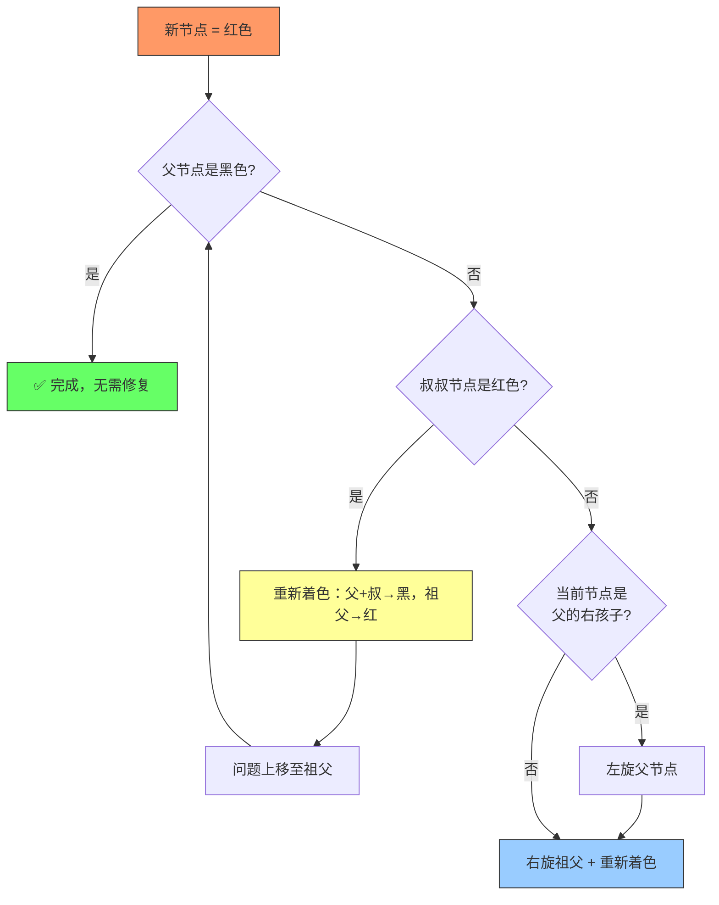

### 旋转操作

> 参数 `x` 为旋转轴心节点，`y` 为其子节点。旋转保持 BST 性质，仅改变局部指针。

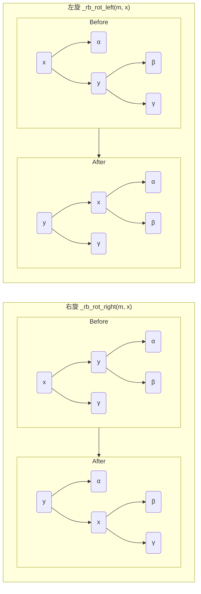

### 查找最小/最大

- 最小：沿左子树走到叶子 → O(log n)
- 最大：沿右子树走到叶子 → O(log n)
- ccmap 维护 `first` 指针，O(1) 获取最小节点

---

## cchashmap — 链式哈希表

侵入式链式哈希表。节点缓存 hash 值避免重复计算。

### 结构

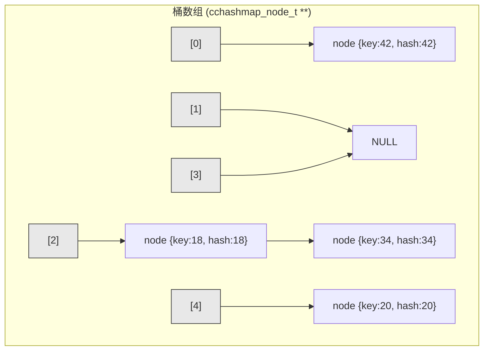

### 核心操作流程

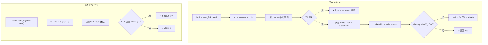

### 扩容 (Rehash)

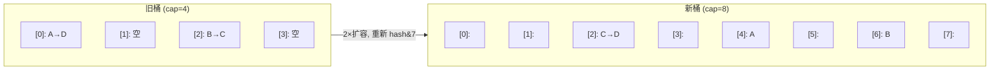

- 容量始终为 2 的幂 → `hash & (cap - 1)` 替代取模
- 负载因子默认 1.25 → 触发 2× 扩容
- 懒分配：首次 insert 才分配桶数组

---

## ccheap — D-ary 堆

D-ary 堆是二叉堆的泛化，每个节点有 D 个子节点（ccheap 支持 2/4/8）。

### 堆结构（以二叉堆为例）

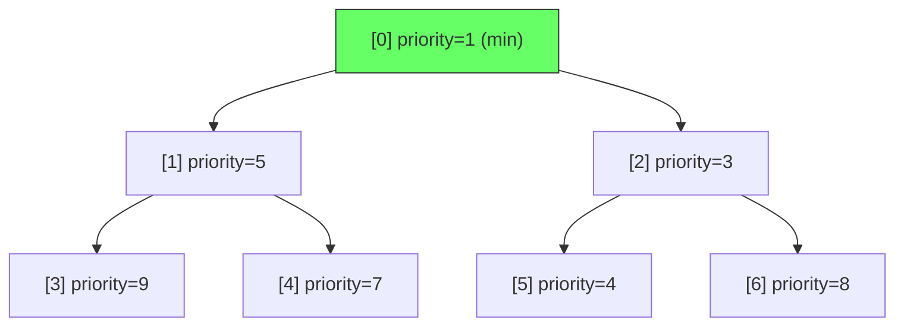

### 插入 (上滤 / Sift-up)

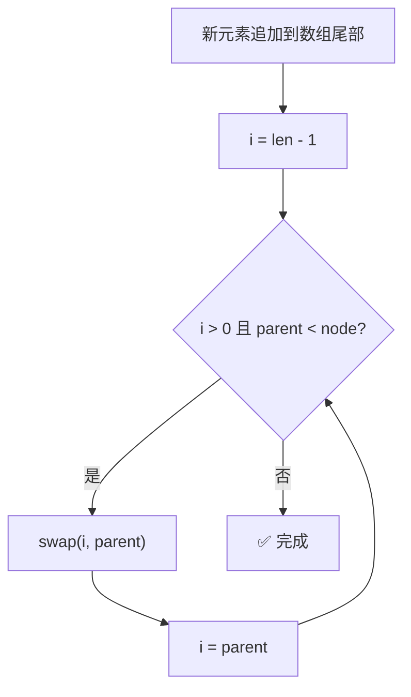

### 弹出 (下滤 / Sift-down)

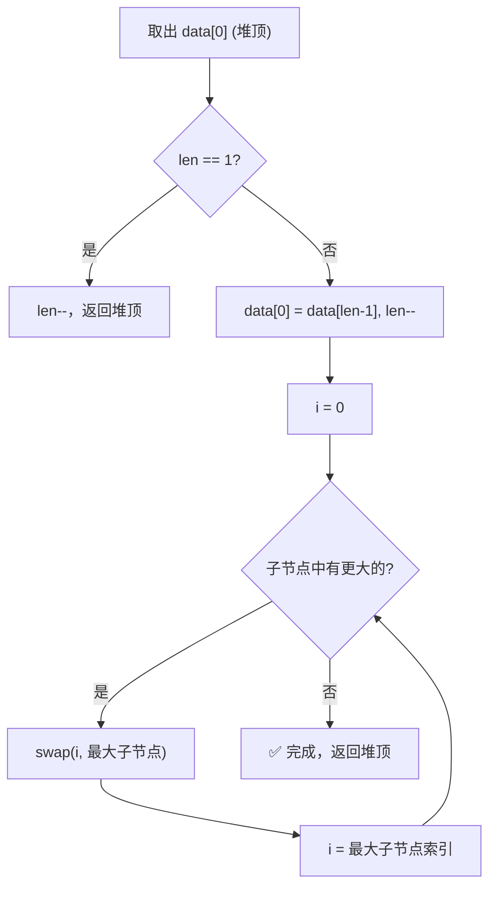

### D-ary 子节点

| Arity | 子节点公式 | 编译期展开 |
| --- | --- | --- |
| 2 | `parent*2+1, parent*2+2` | 2 路 if |
| 4 | `parent*4+k+1` (k=0..3) | 4 路 if |
| 8 | `parent*8+k+1` (k=0..7) | 8 路 if |

> 子节点比较通过 `#if CCHEAP_ARITY_N > N` 编译期展开，无循环开销。

---

## cclink — 侵入式单向链表

- 每个节点只存 `next` 指针
- 头插 O(1)，尾插 O(n)
- 无内部哨兵节点

---

## cclist — 侵入式双向链表

- 使用 head/tail 哨兵节点简化边界条件
- `push_front` / `push_back` 均为 O(1)
- `insert_before` / `insert_after` 给定节点 O(1)
- `splice_back`: 将整个 src 链表移至 dst 尾部，O(1)

---

## ccvector — 动态数组

值存储的连续内存数组，自动扩容。

### 均摊扩容

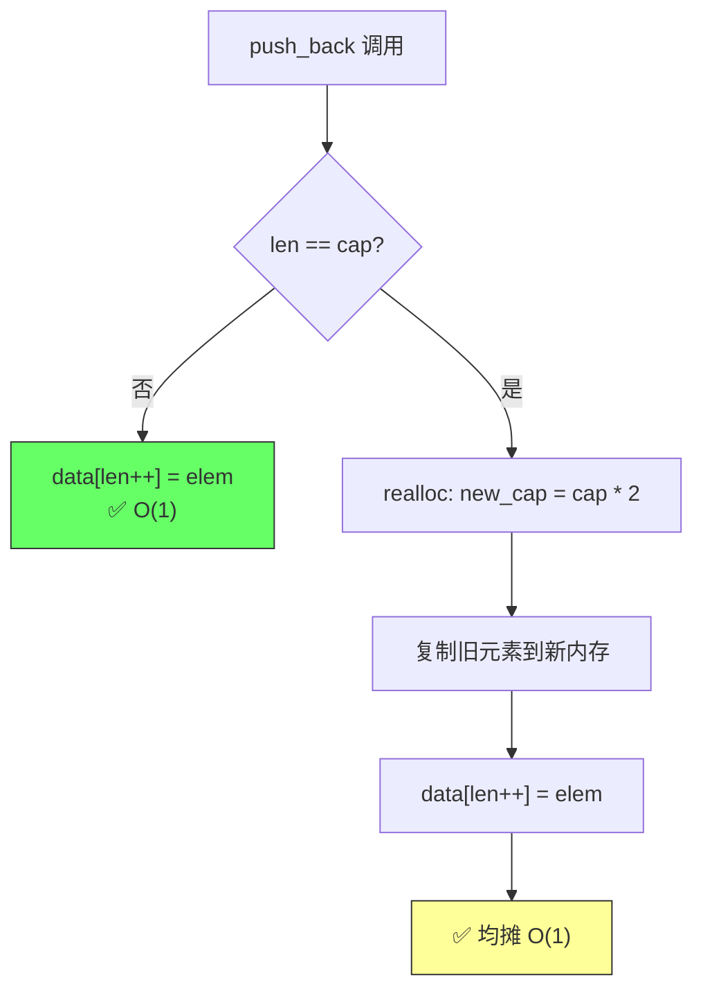

扩容策略：初始 cap=8，每次翻倍，均摊 O(1)。

---

## ccflatmap — 排序数组映射

基于排序数组的 key-value 映射，二分查找 O(log n)，插入 O(n)。

### 插入流程

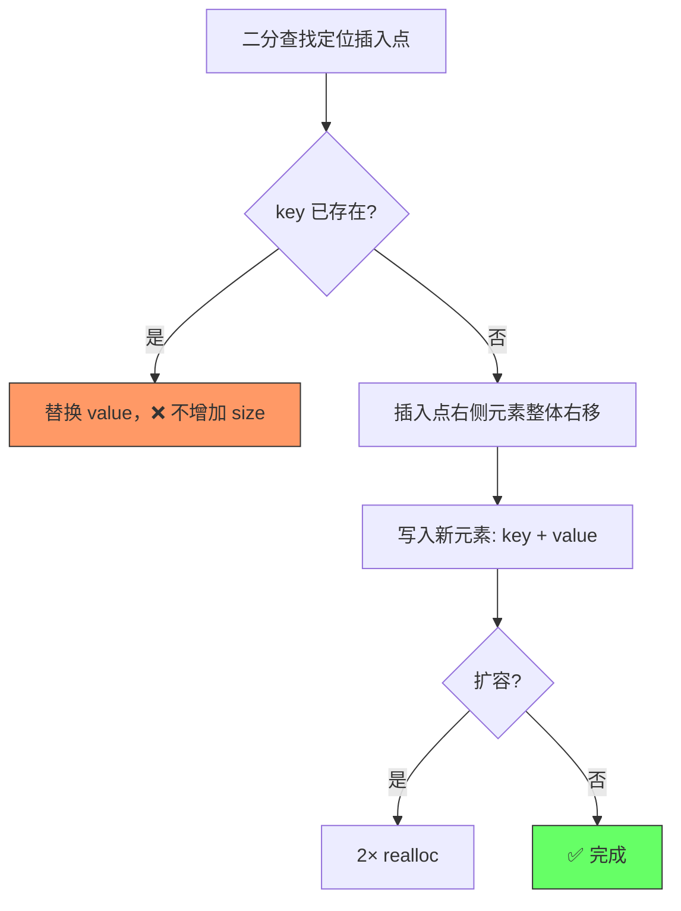

### 二分查找

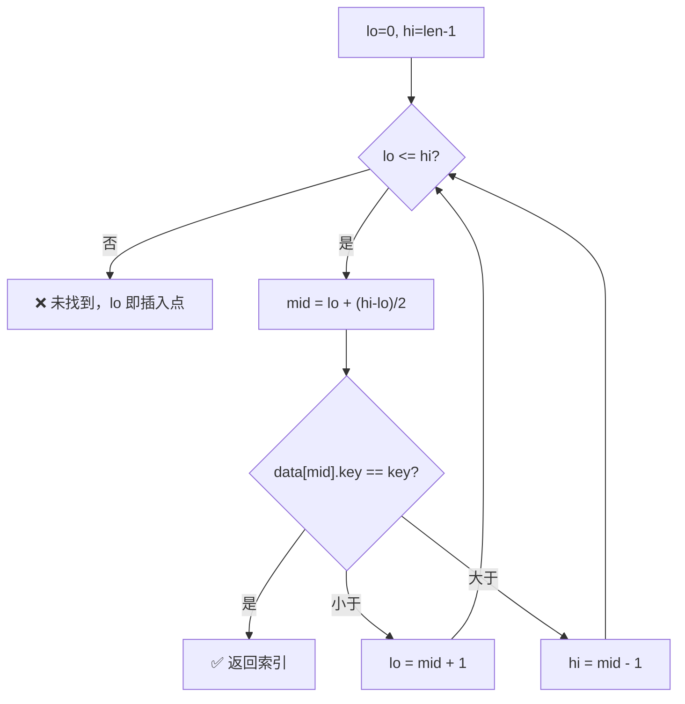

---

## 零开销回调

所有支持比较/哈希的容器均提供两种分发模式：

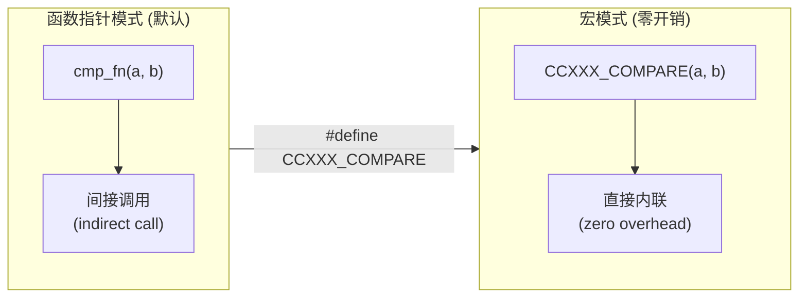

- 宏模式下比较/哈希逻辑被编译器直接内联
- 无函数指针间接调用、无寄存器溢出
- 适合热路径极致性能场景
