# 算法原理

> 每个容器的核心算法与数据结构图解

---

## ccmap — 红黑树

红黑树是自平衡二叉搜索树，每个节点有红/黑颜色属性。ccmap 是侵入式实现——节点嵌入用户结构体。

### 使用场景

| 场景 | 说明 |
| --- | --- |
| **定时器管理** | 以超时时间为 key，`first` 即最近到期定时器。O(1) 取最小 + O(log n) 增删，替代线性扫描 |
| **连接跟踪** | 以 socket fd 为 key 管理 TCP 会话表，O(log n) 查找/更新/关闭，遍历有序（按 fd 排序） |
| **路由表** | IP 前缀为 key，最长前缀匹配用 `find` + `prev/next` 范围扫描 |
| **有序事件队列** | 事件按时间戳排序，`begin→next` 顺序处理，支持动态插入/取消（erase） |

### 红黑树五条性质

1. 节点非红即黑
2. 根节点是黑色
3. 所有叶子（NIL）是黑色
4. 红色节点的两个子节点必须是黑色（无连续红）
5. 从任意节点到其所有后代叶子的每条路径上，黑色节点数量相同（黑高一致）

### 插入流程

插入后可能违反性质 2 或 4，通过**重新着色 + 旋转**修复：

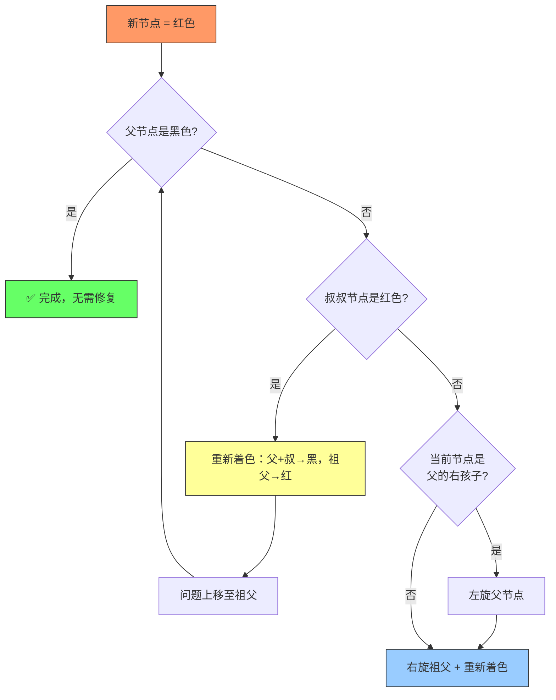

### 旋转操作

> 参数 `x` 为旋转轴心节点，`y` 为其子节点。旋转保持 BST 性质，仅改变局部指针。

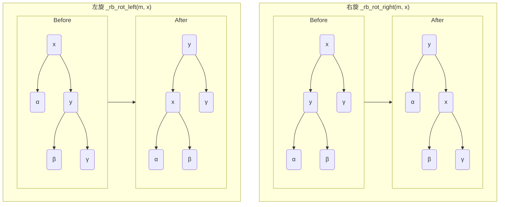

---

## cchashmap — 链式哈希表

侵入式链式哈希表。节点缓存 hash 值避免重复计算。

### 使用场景

| 场景 | 说明 |
| --- | --- |
| **DNS 缓存** | 域名为 key，解析结果为 value，O(1) 查询 + 自动淘汰（外部维护 TTL） |
| **会话存储** | session ID → 用户数据，无序遍历，纯 O(1) 读写 |
| **去重过滤器** | URL / 消息 ID 去重，快速判存在，无需排序 |
| **对象池** | 资源句柄 → 对象指针，频繁获取/归还，均摊 O(1) |

### 结构

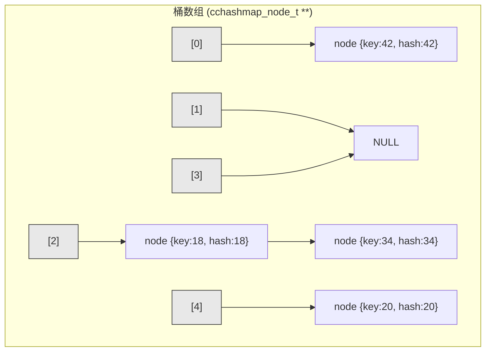

### 核心操作流程

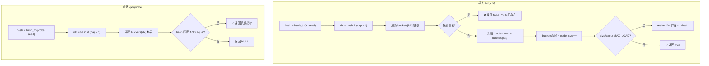

### 扩容 (Rehash)

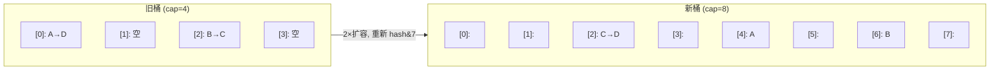

- 容量始终为 2 的幂 → `hash & (cap - 1)` 替代取模
- 负载因子默认 1.25 → 触发 2× 扩容
- 懒分配：首次 insert 才分配桶数组

---

## ccheap — D-ary 堆

D-ary 堆是二叉堆的泛化，每个节点有 D 个子节点（ccheap 支持 2/4/8）。

### 使用场景

| 场景 | 说明 |
| --- | --- |
| **任务调度器** | priority 越小的任务越先执行，`pop` 取最高优先级，`insert` 添加新任务 |
| **定时器轮询** | timeout 为 priority，`peek` 查看最近超时而不弹出，结合事件循环使用 |
| **Top-K 查询** | 维护大小为 K 的最小堆，遍历全量数据，堆顶即为第 K 大 |
| **事件驱动模拟** | 离散事件按时间戳排序，每次 pop 最早事件执行 |
| **A* 路径搜索** | 节点 cost 为优先级，`ccheap_update` 在发现更优路径时 O(log n) 更新已存在节点的代價 |

### 堆结构（以二叉堆为例）

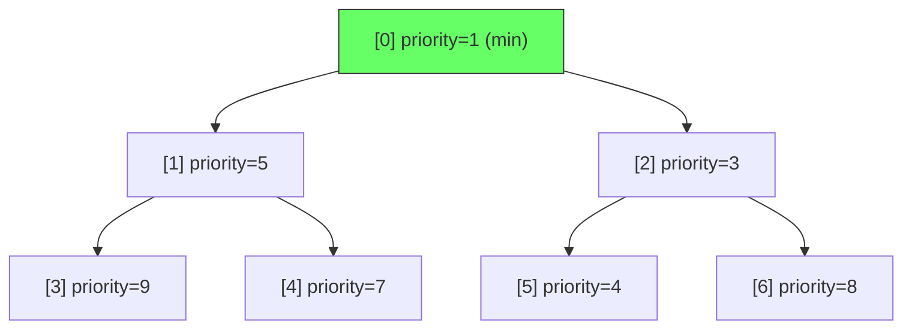

### 插入 (上滤 / Sift-up)

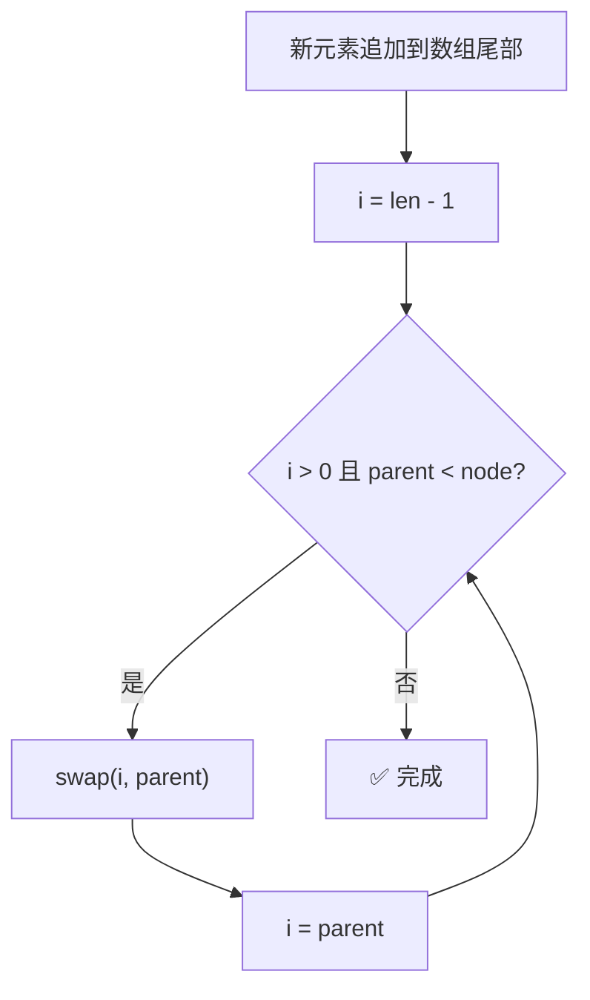

### 弹出 (下滤 / Sift-down)

```mermaid
flowchart TD
    A["取出 data[0] (堆顶)"] --> B{"len == 1?"}
    B -->|是| C["len--，返回堆顶"]
    B -->|否| D["data[0] = data[len-1], len--"]
    D --> E["i = 0"]
    E --> F{"子节点中有更大的?"}
    F -->|是| G["swap(i, 最大子节点)"]
    G --> H["i = 最大子节点索引"]
    H --> F
    F -->|否| I["✅ 完成，返回堆顶"]

### Decrease-key / 节点更新 (可选)

A* / Dijkstra 等算法需要在搜索过程中降低已存在节点的优先级。
通过 `#define CCHEAP_NODE_INDEX <字段名>` 开启索引追踪，节点嵌入额外的
`size_t` 字段记录其在堆数组中的位置，提供 `ccheap_update` 操作。

```c
#define CCHEAP_NODE_INDEX heap_idx
#define CCHEAP_COMPARE(a, b) ((int64_t)((b)->cost - (a)->cost))
#include "ccheap.h"

struct search_node {
    ccheap_node_t hn;        // 内含 .heap_idx 字段
    int x, y;
    double g, f;
};

// 找到更优路径 → O(log n) 更新
n->f = new_f;
ccheap_update(&open_set, &n->hn);
```

**算法流程：**

- `ccheap_update` 用节点的 `CCHEAP_NODE_INDEX` 字段 O(1) 定位其在数组中的位置
- 先尝试**上滤**（bubble-up）：若优先级提高，向根方向交换
- 再尝试**下滤**（sift-down）：若优先级降低，向叶方向下沉
- 两次尝试保证节点落在正确位置

**零开销：** 不定义 `CCHEAP_NODE_INDEX` 时，节点保持 8 字节，无额外指令。

**对比懒删除方案：**

| 方案 | 操作 | 堆大小 | 额外内存 |
| --- | --- | --- | --- |
| 懒删除（无宏） | 发现更优路径时 push 新节点，pop 时跳过 stale | 可能膨胀 | 0 |
| `CCHEAP_NODE_INDEX` | `ccheap_update` O(log n) 原地更新 | 紧凑 | 每个节点 +8B |
```

### D-ary 子节点

| Arity | 子节点公式 | 编译期展开 |
| --- | --- | --- |
| 2 | `parent*2+1, parent*2+2` | 2 路 if |
| 4 | `parent*4+k+1` (k=0..3) | 4 路 if |
| 8 | `parent*8+k+1` (k=0..7) | 8 路 if |

> 子节点比较通过 `#if CCHEAP_ARITY_N > N` 编译期展开，无循环开销。

---

## cclink — 侵入式单向链表

### 使用场景

| 场景 | 说明 |
| --- | --- |
| **哈希桶链** | `cchashmap` 内部每个槽位的冲突链即可用 cclink 实现，纯 forward 遍历 |
| **空闲列表 (free list)** | 对象池中未分配块用单链串起，头取头放 O(1) |
| **LIFO 栈** | `push`=头插 O(1)，`pop_front`=头删 O(1)，无需双向指针 |
| **指令队列** | 简单 FIFO 不要求反向遍历的场景，内存开销最小（每个节点仅 1 指针） |

### 数据结构


- 每个节点只存 `next` 指针
- 无内部哨兵节点

### 操作流程

- 头插 O(1)，尾插 O(n)

---

## cclist — 侵入式双向链表

### 使用场景

| 场景 | 说明 |
| --- | --- |
| **LRU 缓存** | 访问时 `remove` + `push_front` O(1)，淘汰时 `pop_back` O(1) |
| **消息队列** | 生产者 `push_back`，消费者 `pop_front`，均为 O(1) |
| **帧渲染链表** | UI 控件/游戏对象按 Z-order 双向链接，支持 O(1) 插入/移除任意位置 |
| **多级队列** | `splice_back` 将整个子队列原子移动到主队列，O(1) 无拷贝 |

### 数据结构


- 使用 head/tail 哨兵节点简化边界条件

### 操作流程

- `push_front` / `push_back` 均为 O(1)
- `insert_before` / `insert_after` 给定节点 O(1)
- `splice_back`: 将整个 src 链表移至 dst 尾部，O(1)

---

## ccvector — 动态数组

值存储的连续内存数组，自动扩容。

### 使用场景

| 场景 | 说明 |
| --- | --- |
| **批量数据收集** | 遍历过程中 `push_back` 收集结果，最后一次性处理，利用 CPU 缓存局部性 |
| **栈 (LIFO)** | `push_back` / `pop_back` 实现，O(1) 均摊，连续内存无碎片 |
| **临时缓冲区** | 替代 `malloc` 管理动态数组，自动扩容无需手动 realloc |
| **数值计算** | 稠密矩阵/向量按索引随机访问 O(1)，比链表快 10-100×（缓存友好） |

### 数据结构

- 连续内存数组，元素值存储
- `len`（元素数量）+ `cap`（容量）

### 扩容流程

**均摊扩容：**

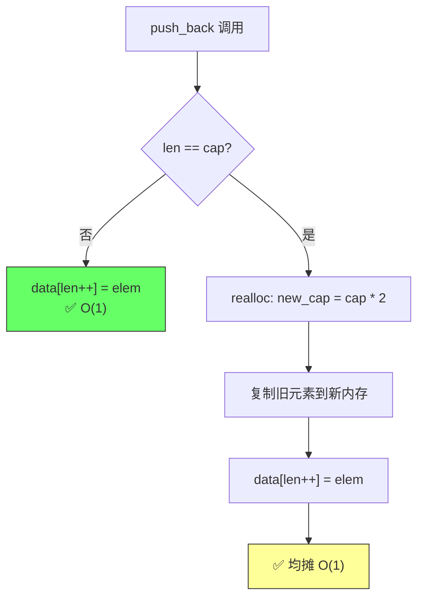

扩容策略：初始 cap=8，每次翻倍，均摊 O(1)。

### 排序

`ccvector_sort` 使用 C 标准库 `qsort` 对元素进行原地排序，O(n log n)。

### 二分查找

排序后可用 `ccvector_bsearch` 进行 O(log n) 二分查找。封装 C 标准库 `bsearch`：

```c
ccvector_sort(&v, my_compare);
int key = 42;
ccvector_node_t *p = ccvector_bsearch(&v, &key, my_compare);
```

比较器签名与 `qsort`/`bsearch` 一致（返回负数 → 键在元素前，正数 → 键在元素后，0 → 匹配）。

```c
ccvector_sort(&v, my_compare);
```

比较器签名与 `qsort` 一致：

```c
int my_compare(const void *a, const void *b) {
    // 返回负数 → a 排在 b 前面
    // 返回正数 → b 排在 a 前面
    // 返回 0   → 相等
}
```

`qsort` 是 C89 标准函数，所有平台（MSVC / GCC / Clang / 嵌入式）均可使用，实现真正的跨平台排序支持。

---

## ccflatmap — 排序数组映射

基于排序数组的 key-value 映射，二分查找 O(log n)，插入 O(n)。

### 使用场景

| 场景 | 说明 |
| --- | --- |
| **配置表** | 启动时批量加载 → `push_back` + `sort` O(n log n)，运行时仅 `find` O(log n)，不改动 |
| **静态字典** | 编译期确定的键值对（国家代码、语言包），连续内存极低空间开销 |
| **只读索引** | 定期全量重建（`push_back` + `sort`），查询 QPS 远高于插入 TPS |
| **二分训练数据** | 大规模排序数组的二分查找，branchless cmov 免分支预测失败惩罚 |

### 数据结构

- 连续内存排序数组，key-value 元素
- `len`（元素数量）+ `cap`（容量）

### 操作流程

**插入：**

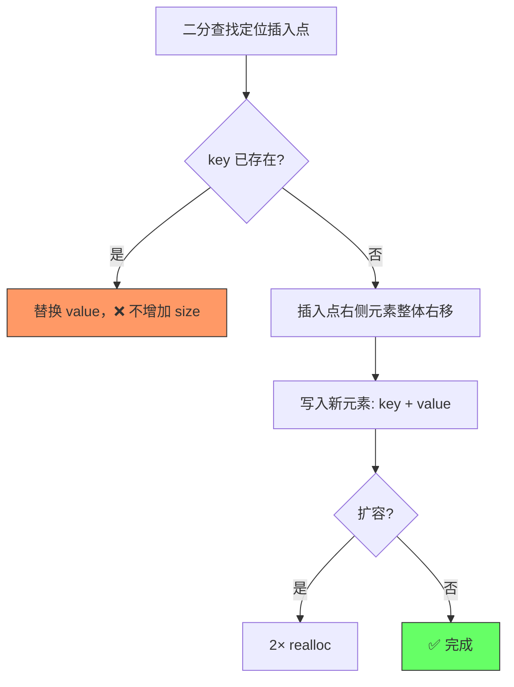

**二分查找：**

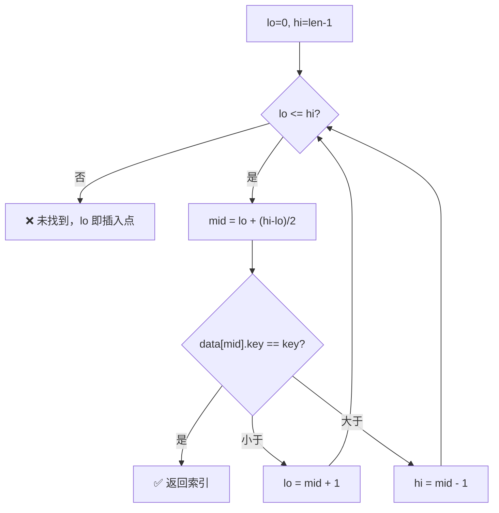

---

## cctreap — Treap (Tree + Heap)

Treap 是二叉搜索树和堆的随机化结合体。每个节点同时维护 **BST 键序**（key）和 **max-heap 堆序**（priority）。随机 priority 使树在期望下保持 O(log n) 高度。

### 使用场景

| 场景 | 说明 |
| --- | --- |
| **排行榜** | 玩家分数为 key，`kth(k)` 取第 k 名 O(log n)，`rank(player)` 查排名 O(log n) |
| **分位数统计** | `kth(size*0.5)` 中位数，`kth(size*0.99)` P99，O(log n) 无需全量排序 |
| **滑动窗口** | 维护最近 N 条记录的有序集合，过期时 `erase` 最旧，`kth` 查任意位置 |
| **数据库索引模拟** | 需要 ORDER BY + LIMIT + OFFSET 的单表查询，treap 一条龙支持 |

### 数据结构

| 性质 | 规则 | 实现 |
| --- | --- | --- |
| BST 性质 | 左子树 key < 当前 key < 右子树 key | `CCTREAP_COMPARE` |
| 堆性质 | 当前 priority > 所有子节点 priority (max-heap) | `_TP_PRIO_CMP`（内部）|

> priority 存储在 `cctreap_node_t::priority` 内，插入时由 xorshift64 自动生成（可通过 `CCTREAP_RAND` 宏替换）。用户无需手动管理。

### 操作流程

**插入：**

BST 下降定位 → 插为叶子 → **向上旋转**恢复堆序：

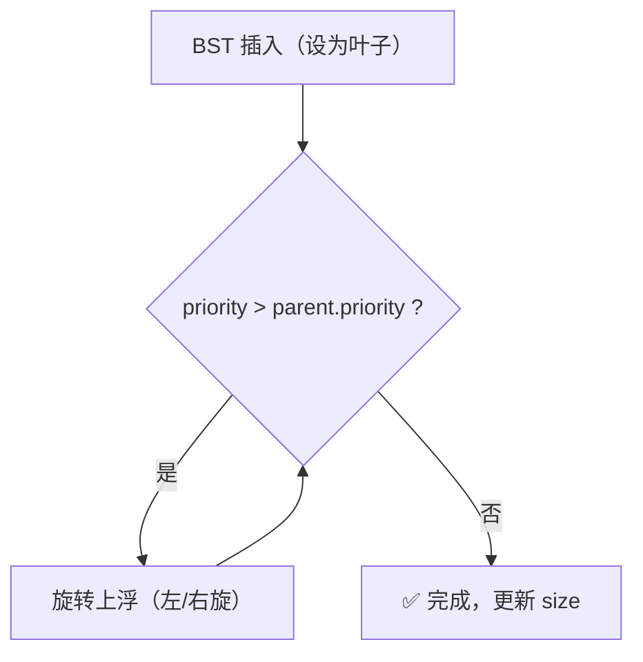

**删除：** 将目标节点 **向下旋转至叶子** 后摘除：

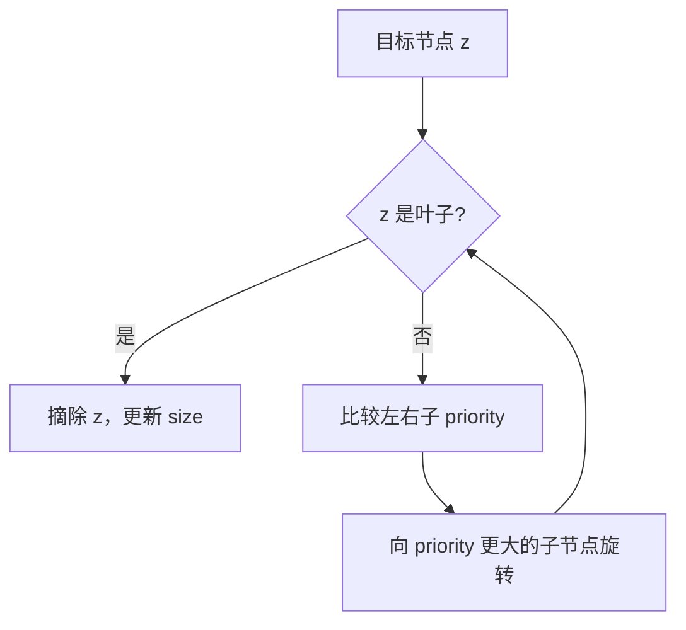

### 其它特性

利用节点内嵌的 `size`（子树节点数）实现 O(log n) 确定查询：

**kth（第 k 小）**：

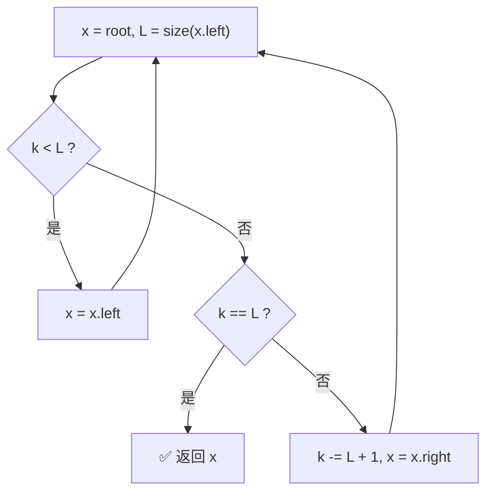

**rank（排名）**：沿 BST 下降，每往右走一步累加左子树大小 + 1，命中时返回累加值 + size(left)。未找到返回 -1。

> kth 和 rank 是确定性 O(log n)，不依赖 priority 随机性。

### 与 ccmap 对比

> 以下对比中 `其它特性` 指 kth/rank 等顺序统计操作。

| 特性 | ccmap (红黑树) | cctreap (treap) |
| --- | --- | --- |
| 平衡机制 | 确定性着色+旋转 | 随机 priority + 旋转 |
| 期望高度 | ≤ 2·log₂(n+1) 确定 | ≤ O(log n) 期望 |
| 最坏高度 | 2·log₂(n+1) 确定 | O(n) 极低概率 |
| 节点大小 (64-bit) | 24B | 32B (含 size + priority) |
| kth / rank | 不支持 | O(log n) |
| 迭代 | O(log n) / O(1) 均摊 | O(log n) / O(1) 均摊 |
| first/last 缓存 | ✅ O(1) | ✅ O(1) |

---

## 零开销回调

所有支持比较/哈希的容器均提供两种分发模式：

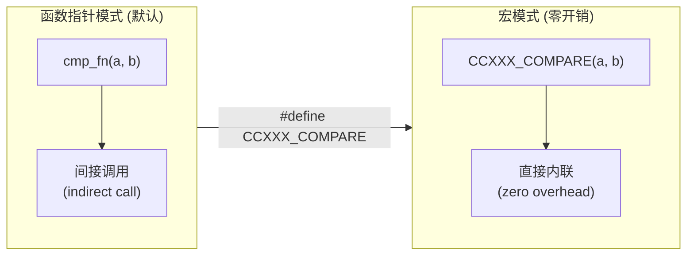

- 宏模式下比较/哈希逻辑被编译器直接内联
- 无函数指针间接调用、无寄存器溢出
- 适合热路径极致性能场景

---

## ccbi — 大数运算

### 内部表示

**小端序符号-绝对值（sign-magnitude）**，limb 基数为 2³²。

```
limbs[0..used-1], 小端序
  limb[0] = 低 32-bit, limb[used-1] = 高 32-bit
```

- `meta` 字段: `sign(2-bit) | used(15-bit) | cap(15-bit)` 压入一个 uint32_t
- `CCBI_SSO_LIMBS` 可配置（默认 8），`sizeof(ccbi_t) = 12 + 4·CCBI_SSO_LIMBS`

### SSO（Small-String Optimization）

```
used ≤ CCBI_SSO_LIMBS:  limbs → internal[] (栈上，零分配)
used > CCBI_SSO_LIMBS:  ccbi_grow → malloc → limbs → 堆
```

### 加法 / 减法

教科书逐 limb 进位/借位：

```
for i = 0..max(n,m):
    sum[i] = a[i] + b[i] + carry    (carry = 0/1)
```

`ccbi_limb_add` / `ccbi_limb_sub` / `ccbi_limb_mul` 是跨容器共用的 limb 原语。

### 乘法 — 三级派发

```
n < 16              → schoolbook O(n²)
16 ≤ n < CCBI_TOOM3 → Karatsuba  O(n^1.585)
n ≥ CCBI_TOOM3_THRESH (默认 64) → Toom-3  O(n^1.465)
```

`squaring` 自动检测 `a == b`，交叉项只算一次再×2，减少 ~47% 乘法。

### 除法 — 左对齐商数位 + 预计算倒数

**单 limb 除数快速路径**: 教材式逐位试商。

**多 limb 除数**: 预计算 `v_recip = ceil(2^64 / v_top)`（一次 divq），
每轮试商用 `qd = (u128)u_top * v_recip >> 64`（一次 mulq）代替 `u_top / v_top`（一次 divq）。

```
while |u| ≥ |v|:
    qd = 试商（mulq）
    u -= qd * v (shifted)
    如果借位传播过头: qd--; u += v
    存储 qd
```

### 模幂 — Montgomery CIOS + Sliding Window

- **小模数** (k < 4): 二进制法
- **大模数** (k ≥ 4): Montgomery CIOS + Sliding Window (w=4)

```
预计算 R² mod m
base → Montgomery 域
for 指数 bit 窗口:
    平方 wlen 次
    × table[window]（Sliding Window 减少乘法次数）
转换回整数域
```

### 位运算

按 magnitude（绝对值）运算，结果恒为非负。

```
AND:  for i = 0..min(|a|,|b|)-1:  z[i] = a[i] & b[i]  高位截断
OR:   for i = 0..max(|a|,|b|)-1:  z[i] = a[i] | b[i]  高位从较长者拷贝
XOR:  for i = 0..max(|a|,|b|)-1:  z[i] = a[i] ^ b[i]  高位拷贝，可能归零
NOT:  bl = bit_length(a)
      for i = 0..(bl/32)-1:  z[i] = ~a[i]
      if bl%32:  z[last] = (~a[last]) & ((1<<bl%32)-1)  掩码高位
```

`ccbi_not` 仅在 `bit_length(a)` 范围内取反，所以 `~1 = 0`、`~2 = 1`。

单 bit 操作为 O(1) limb 定位 ± 潜在 grow：

```
test_bit:  limb = i/32;  (z->limbs[limb] >> i%32) & 1
set_bit:   z->limbs[limb] |= 1 << i%32    (越界自动 grow)
clear_bit: z->limbs[limb] &= ~(1 << i%32) (越界无操作)
flip_bit:  z->limbs[limb] ^= 1 << i%32    (越界等同 set_bit)
```

### 字符串转换

#### from_str — 十进制 9 位分块

```
普通路径:     N 次 mul_uint(10) + add_uint(digit)
分块路径: ceil(N/9) 次 mul_uint(10⁹) + add_uint(chunk)
```

非十进制保持逐字符路径。

#### to_str — 用户缓冲 API

```
ccbi_to_str_len(z, base)        → 预计算所需缓冲区大小
ccbi_to_str_buf(z, buf, len, base) → 写入用户缓冲区（零分配）
ccbi_to_str(z, base)             → 内部 malloc（向后兼容）
```

### 最大公约数 — 二进制 Stein 算法

```
如果 |a,b| 均为偶数: gcd = 2 * gcd(a/2, b/2)
gcd 逻辑:
    while a != 0:
        while a 为偶数: a /= 2
        while b 为偶数: b /= 2
        if |a| ≥ |b|: a = (a - b) / 2
        else:          b = (b - a) / 2
```

- 避免除法（仅用移位 + 减法），比 Euclid 在长整数上更优
- 每次迭代至少消除一个尾零

---

## ccbits — 位运算原语

位运算原语库，跨平台/编译器，GCC/Clang/MSVC 平台使用编译器内建（一条指令），
未知编译器使用纯 C 可移植 fallback。

### popcount — 人口计数（Population Count）

**SWAR（并行加法器）：**

将 32/64 位整数划分为不同大小的块，通过并行掩码加法累加 1-bit 计数。

以 32-bit 为例：

```
Step 1: 每 2-bit 一组统计 1 的个数
  x = x - ((x >> 1) & 0x55555555)

Step 2: 每 4-bit 一组，2-bit 部分和相加
  x = (x & 0x33333333) + ((x >> 2) & 0x33333333)

Step 3: 每 8-bit 一组，4-bit 部分和相加
  x = (x + (x >> 4)) & 0x0F0F0F0F

Step 4: 累加 2 字节
  x = x + (x >> 8)

Step 5: 累加 4 字节，取低 6-bit
  x = x + (x >> 16)
  return x & 0x3F
```

**进位过程图解（以 `0x5B` = 0101 1011 为例）：**

```
                   01  01  10  11
                   ↓   ↓   ↓   ↓
Step 1 (2-bit):    01  01  01  10    (每个 2-bit 块的 1 个数)
Step 2 (4-bit):    0010  0011         (2-bit 和两两相加)
Step 3 (8-bit):    00000101           (4-bit 和相加) → 结果 5 ✓
```

**平台路径：**

| 编译器 | 实现 | 指令 |
| --- | --- | --- |
| GCC/Clang | `__builtin_popcount{ll}` | `POPCNT` (x86) / `VCNT` (ARM NEON) |
| MSVC | `__popcnt16` / `__popcnt` / `__popcnt64` | `POPCNT` |
| 其他 | SWAR 5 级加法 | 纯移位+掩码 |

---

### clz — 前导零计数

**二分分解法：**

逐级检测高位区间是否为零，缩小范围。以 32-bit 为例：

```c
n = 32;
if (x >> 16) { n -= 16; x >>= 16; }   // 高 16 位有 1？缩小到高 16 位
if (x >>  8) { n -=  8; x >>=  8; }   // 高 8 位有 1？
if (x >>  4) { n -=  4; x >>=  4; }
if (x >>  2) { n -=  2; x >>=  2; }
if (x >>  1) { n -=  1; }
return n - x;                           // x 最终为 0 或 1，减去 x 即最后修正
```

**图解 `clz(0x0A000000)`：**

```
x  = 0000 1010 0000 0000 0000 0000 0000 0000
    │                                              n=32
    ├─ x>>16 = 0x0A00 ≠ 0 → n=16, x=0x0A00
    │                                              n=16
    ├─ x>>8 = 0x0A ≠ 0 → n=8, x=0x0A
    │                                              n=8
    ├─ x>>4 = 0 ≠ 0? No
    ├─ x>>2 = 2 ≠ 0? → n=6, x=2
    ├─ x>>1 = 1 ≠ 0? → n=5, x=1
    └─ return 5 - 1 = 4  ✓  (前导 4 个 0)
```

**零值安全：** 对 GCC/Clang 路径，三元 `x ? __builtin_clz(x) : 32` 防止 `__builtin_clz(0)` 的 UB。

---

### ctz — 尾零计数

**16-bit：二分分解法**（与 clz 类似，从低位开始检测）。

**32/64-bit：de Bruijn 乘法**（单次乘法 + 查表，无分支）：

```c
// 分离最低位: lsb = x & -x          (得到 2^k 形式的幂)
// de Bruijn 序列: 0x077CB531 (32-bit)
// idx = (lsb * 0x077CB531) >> 27    (将 2^k 映射到 [0, 31])
// return table[idx]
```

**原理：** de Bruijn 序列 `B(2, k)` 是长度为 `2^k` 的循环序列，包含所有 `k` 位二进制子串恰好一次。
取 `k=5` 的 de Bruijn 序列 `0x077CB531`，乘以 `2^k`（即 `lsb`）相当于左移 `k` 位，
高 5-bit 唯一标识 `k` 的值。只需一个 32 元素查表即可得到 `ctz`。

```
lsb = x & -x           ← 最低位：0x00000080 (= 2⁷)
lsb * 0x077CB531
   = 0x077CB531 << 7   ← 高 5-bit = 00001 110 → idx = 7
table[7] = 7           ← ctz(0x...80) = 7 ✓
```

---

### rotl / rotr — 循环移位

所有主流编译器都将 `(x << k) | (x >> (N - k))` 模式识别为一条 `ROL`/`ROR` 指令。
`k = k & (N-1)` 保证即使调用方传入 `k ≥ N` 也不触发 C 语言 UB。

| 编译器 | 生成指令 |
| --- | --- |
| GCC/Clang (x86) | `ROL` / `ROR` (1 周期) |
| GCC/Clang (ARM) | `ROR` (单条) |
| MSVC (x86/x64) | `_rotl` / `_rotr` → `ROL` / `ROR` |

---

### bswap — 字节序反转

**16-bit：** `(x >> 8) | (x << 8)`

**32-bit：** 二级 delta-swap（先交换 16-bit 半字内的字节，再交换半字）：

```
x         = AB CD EF GH
Step 1    = 0B 0D 0F 0H | A0 C0 E0 G0  =  BA DC FE HG
Step 2    = 0000 FE HG  |  BA DC 0000   =  HG FE DC BA
```

**64-bit：** 三级 delta-swap（8→16→32-bit）。

| 编译器 | 指令 |
| --- | --- |
| GCC/Clang | `__builtin_bswap{16,32,64}` / `MOVBE` / `REV` (ARM) |
| MSVC | `_byteswap_ushort/ulong/uint64` / `BSWAP` |

---

### bitrev — 位反转

**二进制 delta-swap 法（二分反转）：**

每次交换相邻 bit 块，块大小逐级加倍，256 次交换后达到完全反转。

以 8-bit 为例：

```
x        = ab cd ef gh
Step 1   = ba dc fe hg     (交换相邻 1-bit)
Step 2   = dc ba hg fe     (交换相邻 2-bit)
Step 3   = hg fe dc ba     (交换相邻 4-bit)  ✓ 完成反转
```

32-bit 需要 5 级（1→2→4→8→16-bit），64-bit 需要 6 级。

**Clang 特殊路径：** `__builtin_bitreverse{8,32,64}` 在 ARM 上编译为单条 `RBIT` 指令。

---

### ceilpow2 — 上取整 2 的幂

**位涂抹法（无分支）：**

```c
x--;                      // 处理已经是 2 的幂的情况
x |= x >> 1;              // 将最高位右侧 1-bit 填满
x |= x >> 2;
x |= x >> 4;
x |= x >> 8;
x |= x >> 16;             // (32-bit 到此为止)
x |= x >> 32;             // (64-bit 额外一步)
return x + 1;
```

**图解 `ceilpow2(21)`：**

```
x     = 10101 (21)
x--   = 10100 (20)
>>1   = 01010 | 10100 = 11110
>>2   = 00111 | 11110 = 11111
>>4   = 00001 | 11111 = 11111  (已饱和)
...
x+1   = 100000 (32)  ✓
```

**零值处理：** `x=0` 时 `x--` 得 0xFFFFFFFF，涂抹后仍为全 1，`x+1` 溢回 0。

---

### ispow2 — 判 2 的幂

```c
#define ccbits_ispow2_32(x)  (((x) > 0U) & (((x) & ((x) - 1U)) == 0U))
```

**原理：** 2 的幂的二进制形式为 `100...0`，减 1 得 `011...1`，两者按位与得 0。

```
4     = 100    → 4-1 = 011    → 100 & 011 = 0  → 是 ✓
3     = 011    → 3-1 = 010    → 011 & 010 = 2  → 否 ✓
0     = 000    → 0-1 = 111    → 000 & 111 = 0  → 0 > 0 为假 → 0 ✓
```

`&`（位与）代替 `&&`（逻辑与）规避短路分支，整个表达式无跳转。

---

### bit_width — 最小位宽

**原理：** `bit_width(x) = floor(log₂(x)) + 1`。对于 `x>0`，等价于 `N - clz(x)`。

```
bit_width(0)  = 0        （特判）
bit_width(1)  = 32 - 31  = 1
bit_width(8)  = 32 - 28  = 4
bit_width(15) = 32 - 28  = 4    ← 不是对齐到 4，而是 15 需 4-bit 表示
bit_width(16) = 32 - 27  = 5    ← 16 = 10000，需要 5-bit
```

提供 8/16/32/64 四种宽度，由 `clz` 派生，无独立平台路径。
窄宽度（`bit_width8/16`）统一调用 `clz32`：

| 函数 | 公式 | 示例 |
| --- | --- | --- |
| `ccbits_bit_width8` | `32 - clz32((uint8_t)x)` | `0xFF → 32-24 = 8` |
| `ccbits_bit_width16` | `32 - clz32((uint16_t)x)` | `0x8000 → 32-16 = 16` |
| `ccbits_bit_width32` | `32 - clz32(x)` | `0x7FFFFFFF → 32-1 = 31` |
| `ccbits_bit_width64` | `64 - clz64(x)` | `0x8000000000000000 → 64-0 = 64` |

`uint8_t`/`uint16_t` 强转先零扩展再 CLZ，编译器优为 `movzx` + `bsr`/`lzcnt`，零额外开销。

---

### mask_low — 低位掩码

**原理：** `(1 << n) - 1`。当 `n ≥ 宽度` 时饱和为全 1（防止 C 语言移位 ≥ 宽度是 UB）。

```
mask_low(0)  = (1 << 0) - 1 = 0
mask_low(5)  = (1 << 5) - 1 = 0x1F
mask_low(8)  = (1 << 8) - 1 = 0xFF
mask_low(32) → n≥32 → 0xFFFFFFFF
```

---

### parity — 奇偶校验

**原理：** `popcount(x) & 1`。1 的个数为奇数时返回 1，偶数时返回 0。

```
parity(0x00000000) = 0 → 0 bits → even → 0
parity(0x00000001) = 1 → 1 bit  → odd  → 1
parity(0x00000011) = 2 → 2 bits → even → 0
parity(0xFFFFFFFF) = 0 → 32 bits → even → 0
```

提供 8/16/32/64 四种宽度，统一由对应 `popcount` 派生：

| 函数 | 实现 |
| --- | --- |
| `ccbits_parity8` | `popcount8(x) & 1` |
| `ccbits_parity16` | `popcount16(x) & 1` |
| `ccbits_parity32` | `popcount32(x) & 1` |
| `ccbits_parity64` | `popcount64(x) & 1` |

在 x86 上编译器将 `popcount & 1` 优化为单条 `POPCNT` + `AND reg, 1`。

---

### sign_ext — 符号扩展

**原理：** 将低 N 位视为有符号数，扩展到全宽度。使用**经典的 XOR-sub 分支无跳转技巧**：

```c
m = 1U << (n - 1);           // 符号位掩码
return (int32_t)((x ^ m) - m);
```

**图解** `sign_ext32(0x1F, 5)`（将低 5-bit 11111 视为 -1 扩展）：

```
x     = ...0 11111           (低 5-bit: 11111, 符号位=1)
m     = ...0 10000           (第 4-bit 掩码)
x ^ m = ...0 01111           (翻转符号位)
-m    = ...1 10000           (补码)

(x ^ m) - m = ...0 01111 - ...1 10000
           = ...0 01111 + ...0 10000    (补码加法)
           = ...1 11111 = -1            ✓
```

**图解** `sign_ext32(0x0F, 5)`（低 5-bit 01111 = 15，符号位=0）：

```
x     = ...0 01111           (低 5-bit: 01111, 符号位=0)
m     = ...0 10000
x ^ m = ...0 11111           (不变号，仅低 5-bit 翻转)
-m    = ...1 10000

(x ^ m) - m = ...0 11111 - ...1 10000
           = ...0 11111 + ...0 10000
           = ...0 11111 = 15           ✓   (符号位 0 → 正数)
```

**边界处理：** `n=0 或 n≥宽度` 时直接返回 x 本身（无符号扩展空间）。
