# 算法原理

> 每个容器的核心算法与数据结构图解

---

## ccmap — 红黑树

红黑树是自平衡二叉搜索树，每个节点有红/黑颜色属性。ccmap 是侵入式实现——节点嵌入用户结构体。

### 使用场景

| 场景 | 说明 |
| --- | --- |
| **定时器管理** | 以超时时间为 key，`first` 即最近到期定时器。O(1) 取最小 + O(log n) 增删，替代线性扫描 |
| **连接跟踪** | 以 socket fd 为 key 管理 TCP 会话表，O(log n) 查找/更新/关闭，遍历有序（按 fd 排序） |
| **路由表** | IP 前缀为 key，最长前缀匹配用 `find` + `prev/next` 范围扫描 |
| **有序事件队列** | 事件按时间戳排序，`begin→next` 顺序处理，支持动态插入/取消（erase） |

### 红黑树五条性质

1. 节点非红即黑
2. 根节点是黑色
3. 所有叶子（NIL）是黑色
4. 红色节点的两个子节点必须是黑色（无连续红）
5. 从任意节点到其所有后代叶子的每条路径上，黑色节点数量相同（黑高一致）

### 插入流程

插入后可能违反性质 2 或 4，通过**重新着色 + 旋转**修复：

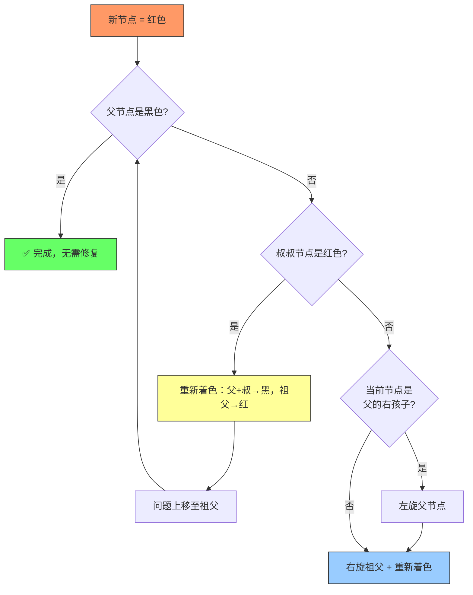

### 旋转操作

> 参数 `x` 为旋转轴心节点，`y` 为其子节点。旋转保持 BST 性质，仅改变局部指针。

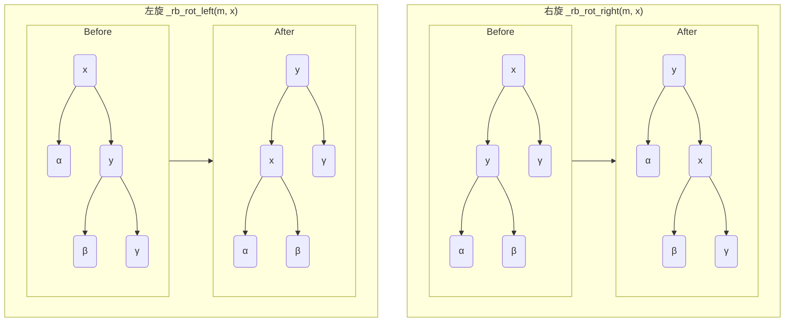

---

## cchashmap — 链式哈希表

侵入式链式哈希表。节点缓存 hash 值避免重复计算。

### 使用场景

| 场景 | 说明 |
| --- | --- |
| **DNS 缓存** | 域名为 key，解析结果为 value，O(1) 查询 + 自动淘汰（外部维护 TTL） |
| **会话存储** | session ID → 用户数据，无序遍历，纯 O(1) 读写 |
| **去重过滤器** | URL / 消息 ID 去重，快速判存在，无需排序 |
| **对象池** | 资源句柄 → 对象指针，频繁获取/归还，均摊 O(1) |

### 结构

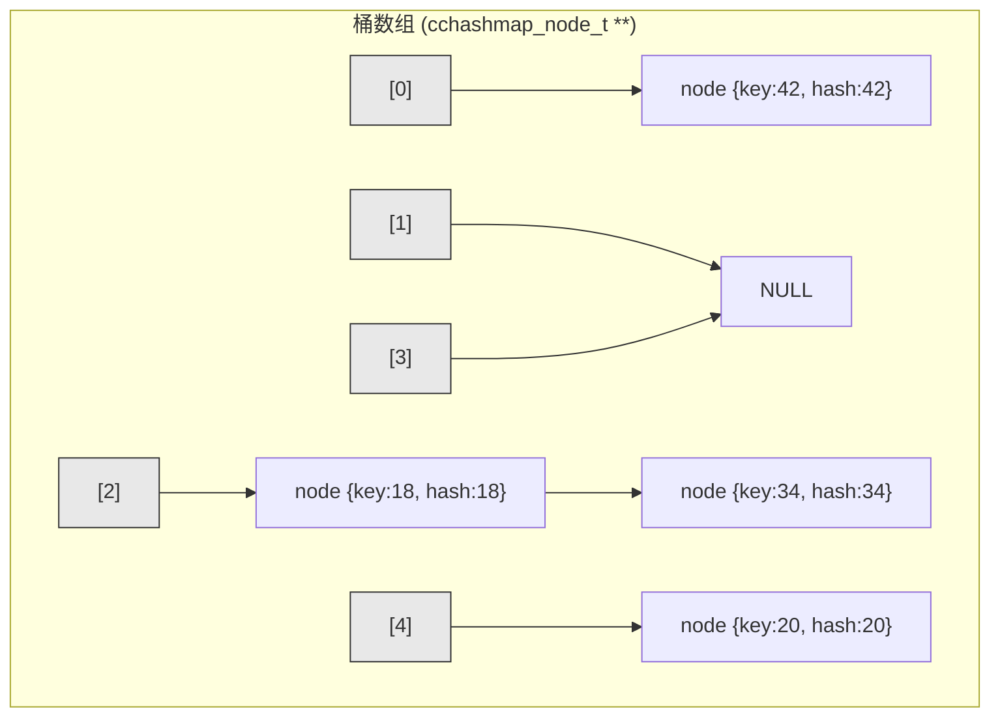

### 核心操作流程

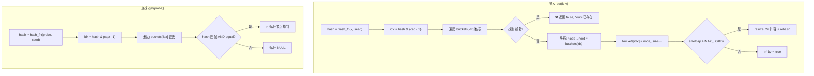

### 扩容 (Rehash)

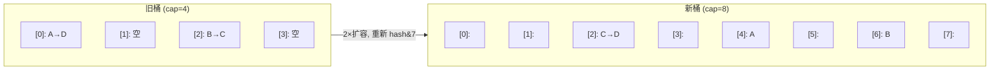

- 容量始终为 2 的幂 → `hash & (cap - 1)` 替代取模
- 负载因子默认 1.25 → 触发 2× 扩容
- 懒分配：首次 insert 才分配桶数组

---

## ccheap — D-ary 堆

D-ary 堆是二叉堆的泛化，每个节点有 D 个子节点（ccheap 支持 2/4/8）。

### 使用场景

| 场景 | 说明 |
| --- | --- |
| **任务调度器** | priority 越小的任务越先执行，`pop` 取最高优先级，`insert` 添加新任务 |
| **定时器轮询** | timeout 为 priority，`peek` 查看最近超时而不弹出，结合事件循环使用 |
| **Top-K 查询** | 维护大小为 K 的最小堆，遍历全量数据，堆顶即为第 K 大 |
| **事件驱动模拟** | 离散事件按时间戳排序，每次 pop 最早事件执行 |

### 堆结构（以二叉堆为例）

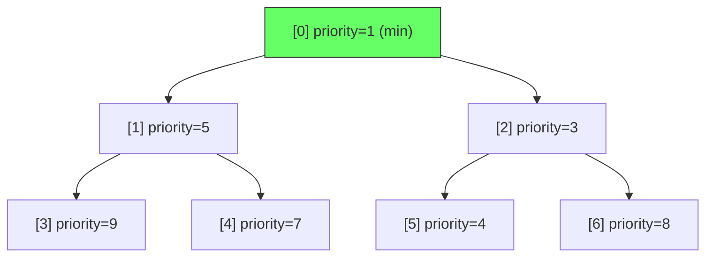

### 插入 (上滤 / Sift-up)

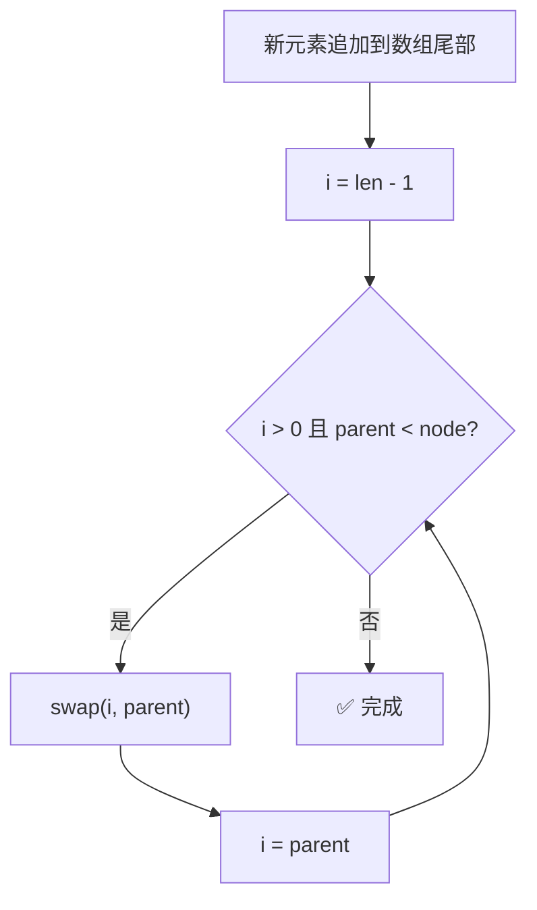

### 弹出 (下滤 / Sift-down)

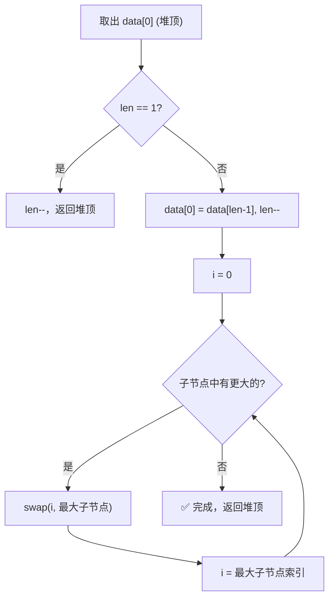

### D-ary 子节点

| Arity | 子节点公式 | 编译期展开 |
| --- | --- | --- |
| 2 | `parent*2+1, parent*2+2` | 2 路 if |
| 4 | `parent*4+k+1` (k=0..3) | 4 路 if |
| 8 | `parent*8+k+1` (k=0..7) | 8 路 if |

> 子节点比较通过 `#if CCHEAP_ARITY_N > N` 编译期展开，无循环开销。

---

## cclink — 侵入式单向链表

### 使用场景

| 场景 | 说明 |
| --- | --- |
| **哈希桶链** | `cchashmap` 内部每个槽位的冲突链即可用 cclink 实现，纯 forward 遍历 |
| **空闲列表 (free list)** | 对象池中未分配块用单链串起，头取头放 O(1) |
| **LIFO 栈** | `push`=头插 O(1)，`pop_front`=头删 O(1)，无需双向指针 |
| **指令队列** | 简单 FIFO 不要求反向遍历的场景，内存开销最小（每个节点仅 1 指针） |

### 数据结构

- 每个节点只存 `next` 指针
- 无内部哨兵节点

### 操作流程

- 头插 O(1)，尾插 O(n)

---

## cclist — 侵入式双向链表

### 使用场景

| 场景 | 说明 |
| --- | --- |
| **LRU 缓存** | 访问时 `remove` + `push_front` O(1)，淘汰时 `pop_back` O(1) |
| **消息队列** | 生产者 `push_back`，消费者 `pop_front`，均为 O(1) |
| **帧渲染链表** | UI 控件/游戏对象按 Z-order 双向链接，支持 O(1) 插入/移除任意位置 |
| **多级队列** | `splice_back` 将整个子队列原子移动到主队列，O(1) 无拷贝 |

### 数据结构

- 使用 head/tail 哨兵节点简化边界条件

### 操作流程

- `push_front` / `push_back` 均为 O(1)
- `insert_before` / `insert_after` 给定节点 O(1)
- `splice_back`: 将整个 src 链表移至 dst 尾部，O(1)

---

## ccvector — 动态数组

值存储的连续内存数组，自动扩容。

### 使用场景

| 场景 | 说明 |
| --- | --- |
| **批量数据收集** | 遍历过程中 `push_back` 收集结果，最后一次性处理，利用 CPU 缓存局部性 |
| **栈 (LIFO)** | `push_back` / `pop_back` 实现，O(1) 均摊，连续内存无碎片 |
| **临时缓冲区** | 替代 `malloc` 管理动态数组，自动扩容无需手动 realloc |
| **数值计算** | 稠密矩阵/向量按索引随机访问 O(1)，比链表快 10-100×（缓存友好） |

### 数据结构

- 连续内存数组，元素值存储
- `len`（元素数量）+ `cap`（容量）

### 扩容流程

**均摊扩容：**

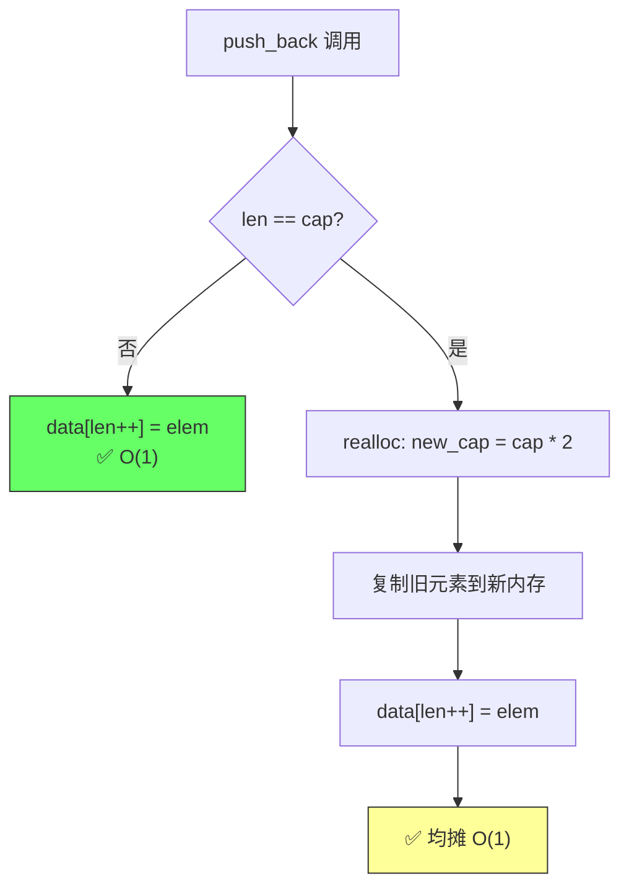

扩容策略：初始 cap=8，每次翻倍，均摊 O(1)。

---

## ccflatmap — 排序数组映射

基于排序数组的 key-value 映射，二分查找 O(log n)，插入 O(n)。

### 使用场景

| 场景 | 说明 |
| --- | --- |
| **配置表** | 启动时批量加载 → `push_back` + `sort` O(n log n)，运行时仅 `find` O(log n)，不改动 |
| **静态字典** | 编译期确定的键值对（国家代码、语言包），连续内存极低空间开销 |
| **只读索引** | 定期全量重建（`push_back` + `sort`），查询 QPS 远高于插入 TPS |
| **二分训练数据** | 大规模排序数组的二分查找，branchless cmov 免分支预测失败惩罚 |

### 数据结构

- 连续内存排序数组，key-value 元素
- `len`（元素数量）+ `cap`（容量）

### 操作流程

**插入：**

```mermaid
flowchart TD
    A["二分查找定位插入点"] --> B{"key 已存在?"}
    B -->|是| C["替换 value，❌ 不增加 size"]
    B -->|否| D["插入点右侧元素整体右移"]
    D --> E["写入新元素: key + value"]
    E --> F{"扩容?"}
    F -->|是| G["2× realloc"]
    F -->|否| H["✅ 完成"]
    
    style C fill:#f96,stroke:#333
    style H fill:#6f6,stroke:#333
```

**二分查找：**

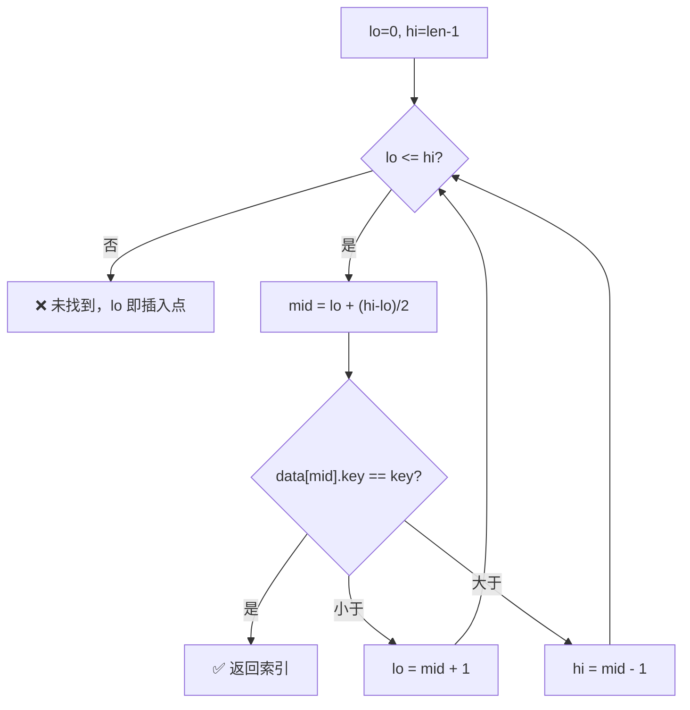

---

## cctreap — Treap (Tree + Heap)

Treap 是二叉搜索树和堆的随机化结合体。每个节点同时维护 **BST 键序**（key）和 **max-heap 堆序**（priority）。随机 priority 使树在期望下保持 O(log n) 高度。

### 使用场景

| 场景 | 说明 |
| --- | --- |
| **排行榜** | 玩家分数为 key，`kth(k)` 取第 k 名 O(log n)，`rank(player)` 查排名 O(log n) |
| **分位数统计** | `kth(size*0.5)` 中位数，`kth(size*0.99)` P99，O(log n) 无需全量排序 |
| **滑动窗口** | 维护最近 N 条记录的有序集合，过期时 `erase` 最旧，`kth` 查任意位置 |
| **数据库索引模拟** | 需要 ORDER BY + LIMIT + OFFSET 的单表查询，treap 一条龙支持 |

### 数据结构

| 性质 | 规则 | 实现 |
| --- | --- | --- |
| BST 性质 | 左子树 key < 当前 key < 右子树 key | `CCTREAP_COMPARE` |
| 堆性质 | 当前 priority > 所有子节点 priority (max-heap) | `_TP_PRIO_CMP`（内部）|

> priority 存储在 `cctreap_node_t::priority` 内，插入时由 xorshift64 自动生成（可通过 `CCTREAP_RAND` 宏替换）。用户无需手动管理。

### 操作流程

**插入：**

BST 下降定位 → 插为叶子 → **向上旋转**恢复堆序：

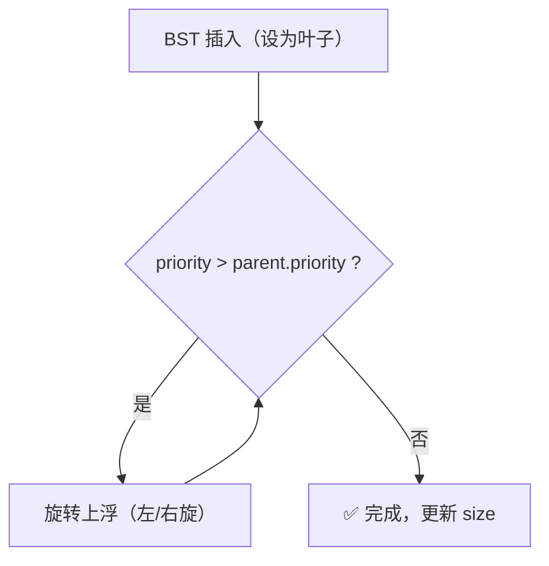

**删除：** 将目标节点 **向下旋转至叶子** 后摘除：

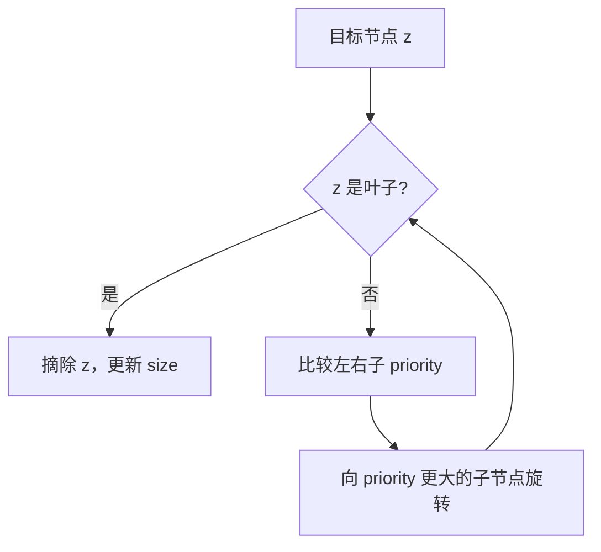

### 其它特性

利用节点内嵌的 `size`（子树节点数）实现 O(log n) 确定查询：

**kth（第 k 小）**：

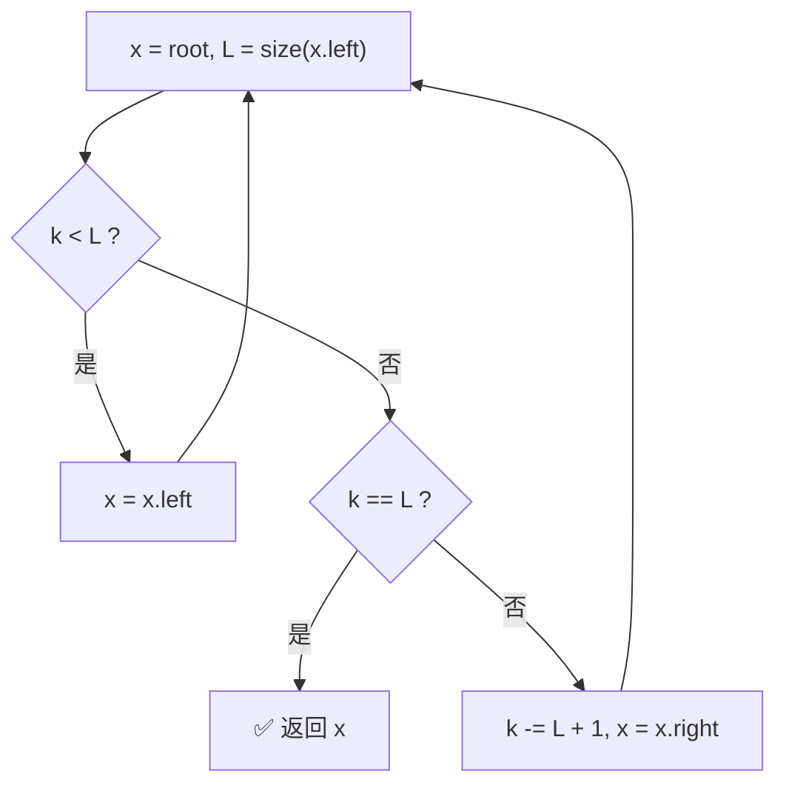

**rank（排名）**：沿 BST 下降，每往右走一步累加左子树大小 + 1，命中时返回累加值 + size(left)。未找到返回 -1。

> kth 和 rank 是确定性 O(log n)，不依赖 priority 随机性。

### 与 ccmap 对比

> 以下对比中 `其它特性` 指 kth/rank 等顺序统计操作。

| 特性 | ccmap (红黑树) | cctreap (treap) |
| --- | --- | --- |
| 平衡机制 | 确定性着色+旋转 | 随机 priority + 旋转 |
| 期望高度 | ≤ 2·log₂(n+1) 确定 | ≤ O(log n) 期望 |
| 最坏高度 | 2·log₂(n+1) 确定 | O(n) 极低概率 |
| 节点大小 (64-bit) | 24B | 32B (含 size + priority) |
| kth / rank | 不支持 | O(log n) |
| 迭代 | O(log n) / O(1) 均摊 | O(log n) / O(1) 均摊 |
| first/last 缓存 | ✅ O(1) | ✅ O(1) |

---

## 零开销回调

所有支持比较/哈希的容器均提供两种分发模式：

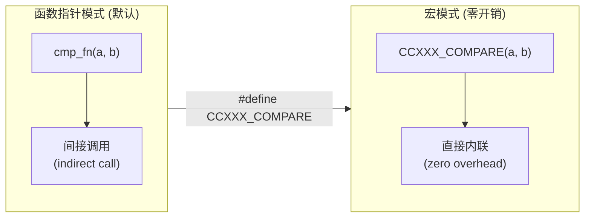

- 宏模式下比较/哈希逻辑被编译器直接内联
- 无函数指针间接调用、无寄存器溢出
- 适合热路径极致性能场景
