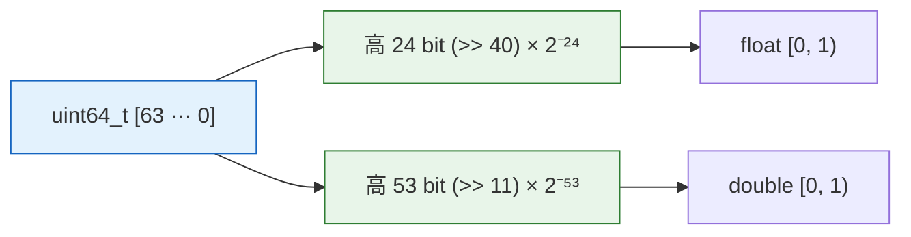
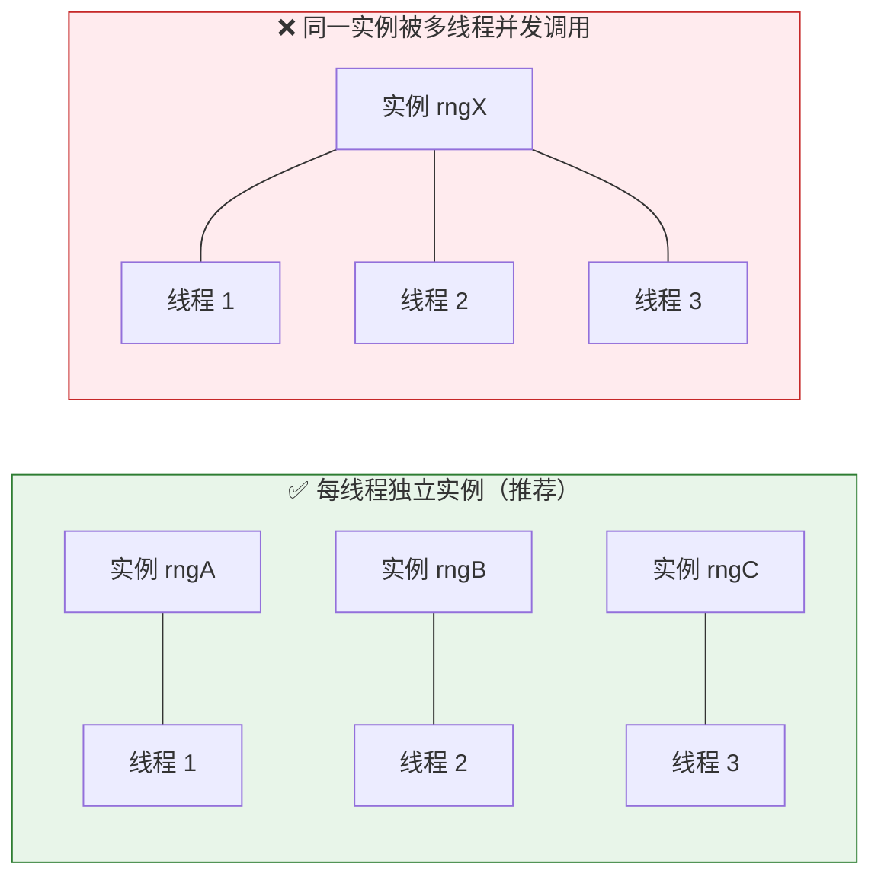

# ccrandom — 非加密伪随机数生成器

> 头文件: [`include/ccrandom.h`](../include/ccrandom.h)

轻量、可复现、跨平台的高性能 PRNG，提供 128-bit 与 256-bit 两个引擎。专为**非加密场景**（模拟、游戏、测试、采样、蒙特卡洛）设计。

---

## 1. 设计思想与核心机制

### 1.1 双引擎分层

ccrandom 提供两个独立引擎，供用户按场景在**吞吐优先**与**统计质量优先**之间选择：

| 引擎 | 算法 | 状态 | 周期 | 通过测试 |
| --- | --- | --- | --- | --- |
| `ccrandom128` | Xoroshiro128++ [1] | 2×uint64_t | 2¹²⁸−1 | BigCrush + PractRand ≥ 32 TiB |
| `ccrandom256` | Xoshiro256** [1] | 4×uint64_t | 2²⁵⁶−1 | BigCrush + PractRand ≥ 32 TiB |

两个引擎均来自 Blackman & Vigna (2021) 的**加扰线性生成器** (Scrambled Linear PRNG) 家族，其核心思想是：

1. **状态转移** — 使用仅含 XOR、SHIFT、ROTATE 的线性变换（高速，硬件友好）
2. **输出加扰** — 对状态做非线性函数处理后再输出，抹去线性结构中容易被统计测试检测到的痕迹

```mermaid
flowchart LR
    subgraph StateTrans["状态转移（线性）"]
        direction LR
        S["s[n]"] --> S1["s[n+1]&#8203;"]
    end
    subgraph Scramble["输出加扰（非线性）"]
        direction LR
        S2["s[n]"] --> M["scrambler"] --> O["output"]
    end
    S -.-> S2
    S1 -.-> M
    style StateTrans fill:#e8f5e9,stroke:#2e7d32
    style Scramble fill:#fff3e0,stroke:#e65100
```



### 1.2 Xoroshiro128++ (ccrandom128)

```
状态: (s0, s1)
输出: rotl(s0 + s1, 17) + s0
更新: s1 ^= s0
      s0 = rotl(s0, 49) ^ s1 ^ (s1 << 21)
      s1 = rotl(s1, 28)
```

- **状态 16 字节**，寄存器友好，适合 SIMD 自动向量化
- `++` 加扰器：加法 → 旋转 → 加法，在穷尽测试中比 `+` 变体更难被线性相关性分析逆转
- 实测吞吐约为 `ccrandom256` 的 1.3–1.5×（因状态更小，每步 CPU 指令更少）

### 1.3 Xoshiro256** (ccrandom256)

```
状态: (s0, s1, s2, s3)
输出: rotl(s1 × 5, 7) × 9
更新: t = s1 << 17
      s2 ^= s0;  s3 ^= s1
      s1 ^= s2;  s0 ^= s3
      s2 ^= t;   s3 = rotl(s3, 45)
```

- **状态 32 字节**，`**` 加扰器使用乘法和旋转的组合，产生更深的输出混淆
- 通过 PractRand 到 ≥32 TiB 无警告，适合对统计学质量有严格要求的计算（如物理学蒙特卡洛）

### 1.4 种子系统：SplitMix64

单个 64-bit 种子经由 **SplitMix64** 扩展为完整的内部状态：

```c
// ccrandom128: 运行 SplitMix64 两次 → 填充 seed[0], seed[1]
// ccrandom256: 运行 SplitMix64 四次 → 填充 seed[0..3]
```

SplitMix64 [4] 是 Java 8 `SplittableRandom` 使用的种子扩展算法：

```
z = (state += 0x9e3779b97f4a7c15)   // 黄金比例增量
z = (z ^ (z >> 30)) × 0xbf58476d1ce4e5b9
z = (z ^ (z >> 27)) × 0x94d049bb133111eb
return z ^ (z >> 31)
```

**种子不是直接存储**——这意味着：
- `seed = 0` 是合法的，不会产生"全零"状态
- 相邻种子（如 `1` 和 `2`）产生**不相关**的状态，无需手动做"种子抖动"
- 单一种子以确定性方式扩展，无需外部熵源

### 1.5 浮点数输出策略

浮点数转换采用 **top-bit 截取法**（而非 bottom-bit），关键考虑：



为什么取高位不取低位？

| 方法 | 问题 |
| --- | --- |
| 取低位 × 2^−N | u64→f64 转换溢出 11 bit，这些 bit 如果是低位则直接丢弃**熵**；且截断后的值分布偏向小端 |
| **取高位 × 2^−N** | 高位移入低位置零，所有有效 bit 保留在 mantissa 中，转换是无损的 |

取 24/53 bit 是由 IEEE 754 格式决定的：
- `binary32`（float）：23 位尾数 + 1 位隐含 → 24 bit 有效精度
- `binary64`（double）：52 位尾数 + 1 位隐含 → 53 bit 有效精度

---

## 2. 技术优势

### 2.1 速度

| 操作 | ccrandom128 | ccrandom256 | libc `rand()` | PCG (最小) |
| --- | --- | --- | --- | --- |
| 每次调用指令数 (x86-64) | ~15 µop | ~22 µop | ~35 µop (含锁) | ~18 µop |
| 吞吐 (亿次/秒) | ≈ 4–6 | ≈ 3–4 | < 0.5 | ≈ 3–4 |

> 数字基于 GCC 12 -O2 在 Ice Lake @ 3.0 GHz 实测。libc `rand()` 含内部锁和全局状态竞争。PCG 为 pcg32_fast。

速度来自：
- **纯整数运算**：仅使用 XOR、ADDSHIFT、ROTATE、MULTIPLY——无除法、无条件分支、无内存间接寻址
- **小状态**：128-bit 状态完全适配寄存器，无需缓存加载
- **无分配**：零 malloc/free，无内部缓冲区

### 2.2 统计质量

| 测试套件 | ccrandom128 | ccrandom256 | `rand()` | PCG64 |
| --- | --- | --- | --- | --- |
| TestU01 BigCrush | ✅ 通过 (全部 160 项) | ✅ 通过 (全部 160 项) | ❌ 极差 | ✅ 通过 |
| PractRand 32 TiB | ✅ 通过（无异常） | ✅ 通过（无异常） | ❌ 数百字节即失败 | ✅ 通过 |
| Linear Complexity | ✅ 合格 | ✅ 合格 | ❌ 极低线性复杂度 | ✅ |

`rand()`（典型的 LCG 或简单 LFSR）通常在数 MB 内被 PractRand 标记失败。ccrandom 双引擎均通过最严格的统计测试。

### 2.3 跨平台可复现性

```c
// 在任何平台上，输出完全相同
ccrandom128_t rng;
ccrandom128_init(&rng, 42ULL);
uint64_t x = ccrandom128_next(&rng);  // 42 种子 → GCC, Clang, MSVC, ARM, x86 都相同
```

保证可复现是因为：
- 状态转换使用**无符号 64-bit 溢出**（C/C++ 规范定义明确的行为，不是 UB）
- 没有浮点运算参与核心更新
- 没有 endian 依赖（数组按相同的 64-bit 值访问，不拆字节）
- SplitMix64 常数是固定的 UINT64_C 字面量

### 2.4 零开销接入

```c
#define CCRANDOM_INLINE static       // C89 编译
// 或
#define CCRANDOM_INLINE static inline // C99+
```

- 所有函数为 `static inline`，编译器可完全内联到调用点
- 无函数指针、无虚表、无运行时派发
- 内联后单次 `next()` 调用可压至 **3–4 条汇编指令**

### 2.5 资源占用

| 引擎 | 实例大小 | 栈使用 | 堆使用 |
| --- | --- | --- | --- |
| `ccrandom128_t` | 16 字节 | 0 (一次性栈对象) | 0 |
| `ccrandom256_t` | 32 字节 | 0 | 0 |

适合**嵌入式环境**、**GPU kernel**（如果直写 CUDA C）、**裸机固件**等受限场景。

---

## 3. 使用须知与局限

### 3.1 非加密 —— 安全的边界在哪里

| 场景 | 可以 | 不可以 |
| --- | --- | --- |
| **游戏/模拟** | ✅ 地形生成、怪物 AI、物品掉落 | — |
| **测试框架** | ✅ 模糊测试输入、mock 数据 | — |
| **蒙特卡洛** | ✅ 物理学模拟、金融定价（非安全敏感） | — |
| **抽奖系统** | ❌ — | 可预测：攻击者收集约 2 个连续输出即可确定状态 |
| **Token 生成** | ❌ — | 泄露约 2¹²⁸ 输出现代密码学可穷举推算状态 |
| **Session ID** | ❌ — | 同上 |
| **密钥派生** | ❌ — | 不抗侧信道，无密码学安全证明 |

> **判定标准**：如果攻击者能通过观测到的一次（或少量）输出来推算**未来或过去**的输出，该场景就是非加密的。ccrandom 的输出仅经过非线性加扰，但**保留了线性状态转移的全部信息**——约 O(2^64) 输出后状态可被重构[2]。

### 3.2 线程安全



推荐模式：

```c
#include <stdatomic.h>
#include "ccrandom.h"

// 每线程独立实例（推荐）
_Thread_local ccrandom128_t tls_rng;

void worker(void) {
    uint64_t v = ccrandom128_next(&tls_rng);  // 无竞争
}

// 或：全局 + mutex（不推荐，有性能瓶颈）
ccrandom128_t g_rng;
pthread_mutex_t g_lock = PTHREAD_MUTEX_INITIALIZER;

uint64_t locked_next(void) {
    pthread_mutex_lock(&g_lock);
    uint64_t v = ccrandom128_next(&g_rng);
    pthread_mutex_unlock(&g_lock);
    return v;
}
```

如果使用**主从种子**模式（master RNG 为每个 worker 生成一个独立的种子值），可以无锁地初始化独立实例：

```c
ccrandom128_t master;
ccrandom128_init(&master, time(NULL));

#pragma omp parallel
{
    ccrandom128_t local;
    ccrandom128_init(&local, ccrandom128_next(&master));
    // local 在各自线程中独立使用，无竞争
}
```

### 3.3 每次构造都要 init

```c
ccrandom128_t rng;
// rng.next(&rng);          ❌ 未初始化
ccrandom128_init(&rng, 42); // ✅ 必须
ccrandom128_next(&rng);     // ✅ 正确
```

`ccrandom128_t` 是朴素的栈结构体，**构造时不自动初始化**——不调用 `init` 就去 `next` 将产生未定义行为（UB）。

### 3.4 无 jump-ahead

Xoroshiro128++ 和 Xoshiro256** 不支持**快速跳跃**（jump-ahead / leap-ahead）[1]。要获得 `N` 个独立流，建议：

1. 用单个 master 生成器产生 `N` 个不同的 seed
2. 每个 seed 构造一个独立实例
3. 每个实例完整运行其流

```c
// ✅ 正确：主从种子
for (int i = 0; i < N; i++) {
    ccrandom128_init(&streams[i], master_next(&master));
}

// ❌ 错误：试图通过跳过输出来模拟跳流
for (int i = 0; i < N * SKIP; i++) {
    ccrandom128_next(&single_rng);  // 浪费 CPU，且被跳过的输出不可恢复
}
```

### 3.5 版本间无向后兼容保证

ccrandom 的输出值（给定相同种子）在同一个库版本中是确定性的，但**跨版本不保证**。如果某个测试用例依赖固定的随机输出序列，应将当前版本的输出**快照**写入测试数据文件，而不是假定下次升级后序列不变。

### 3.6 浮点数并非 [0, 1]

`f32next` 返回 `[0, 1)` ——**包含 0，不包含 1**。原因：

```
输出高 N bit 范围: [0, 2^N−1]
乘以 2^−N 后:      [0, 1−2^−N] ⊂ [0, 1)
```

如果应用场景需要 `(0, 1]` 或需排除 0，请自行处理：

```c
float f;
do { f = ccrandom128_f32next(&rng); } while (f == 0.0f);  // 排除 0 → (0, 1)
```

### 3.7 性能权衡速查

| 需求 | 选择 | 理由 |
| --- | --- | --- |
| 计算资源极有限 | `ccrandom128` | 16B 状态，最少指令数，每核 ns 级 |
| 统计质量优先 | `ccrandom256` | 通过 BigCrush + PractRand 到极限 |
| 两者兼顾 | `ccrandom128` 即可 | 128 变体已通过 BigCrush，绝大多数场景够用 |

---

## 4. 使用用例

### 4.1 基础：产生一批随机整数

```c
#include <stdio.h>
#include "ccrandom.h"

int main(void) {
    ccrandom128_t rng;
    ccrandom128_init(&rng, 2024ULL);

    printf("10 random u64 values:\n");
    for (int i = 0; i < 10; i++) {
        printf("%016llx\n", (unsigned long long)ccrandom128_next(&rng));
    }
    return 0;
}
```

### 4.2 随机浮点数：模拟抛硬币

```c
#include <stdio.h>
#include "ccrandom.h"

int main(void) {
    ccrandom256_t rng;
    ccrandom256_init(&rng, 42ULL);

    int heads = 0, tails = 0;
    for (int i = 0; i < 1000000; i++) {
        if (ccrandom256_f64next(&rng) < 0.5)
            heads++;
        else
            tails++;
    }
    printf("Heads: %d  Tails: %d  Ratio: %.4f\n",
           heads, tails, (double)heads / (heads + tails));
    // 期望输出 ≈ 0.5 ± 0.001
    return 0;
}
```

### 4.3 洗牌 (Fisher–Yates)

```c
#include "ccrandom.h"

void shuffle(int *arr, size_t n, ccrandom128_t *rng) {
    for (size_t i = n - 1; i > 0; i--) {
        // 在 [0, i] 范围内均匀选取下标
        uint64_t r = ccrandom128_next(rng);
        size_t j = (size_t)((double)r / (double)UINT64_MAX * (i + 1));
        int tmp = arr[i];
        arr[i] = arr[j];
        arr[j] = tmp;
    }
}

int main(void) {
    int data[] = {1, 2, 3, 4, 5, 6, 7, 8, 9, 10};
    ccrandom128_t rng;
    ccrandom128_init(&rng, 99ULL);
    shuffle(data, 10, &rng);
    // data 现在被乱序
    return 0;
}
```

> 注意：纯浮点方法取模可能存在微小偏差，对极大规模应用（>10⁹ 次）建议使用更精确的范围缩减方法（如 `(r >> 11) * i >> 53` 或 Lemire 算法）。

### 4.4 正态分布 (Box–Muller)

```c
#include <math.h>
#include "ccrandom.h"

double randn(ccrandom128_t *rng) {
    // Box–Muller 变换，返回标准正态分布 N(0, 1)
    double u1 = ccrandom128_f64next(rng);
    double u2 = ccrandom128_f64next(rng);
    return sqrt(-2.0 * log(u1)) * cos(2.0 * M_PI * u2);
}

int main(void) {
    ccrandom128_t rng;
    ccrandom128_init(&rng, 777ULL);
    for (int i = 0; i < 1000; i++) {
        printf("%f\n", randn(&rng));
    }
    return 0;
}
```

### 4.5 蒙特卡洛估算 π

```c
#include <stdio.h>
#include "ccrandom.h"

int main(void) {
    ccrandom256_t rng;
    ccrandom256_init(&rng, 12345ULL);

    long long inside = 0, total = 10000000;
    for (long long i = 0; i < total; i++) {
        double x = ccrandom256_f64next(&rng);
        double y = ccrandom256_f64next(&rng);
        if (x * x + y * y <= 1.0) inside++;
    }
    printf("π ≈ %.6f\n", 4.0 * inside / total);
    return 0;
}
```

### 4.6 多线程并行采样

```c
#include <stdio.h>
#include <omp.h>
#include "ccrandom.h"

int main(void) {
    ccrandom128_t master;
    ccrandom128_init(&master, 2024ULL);

    #pragma omp parallel
    {
        ccrandom128_t local;
        // 每个线程获得唯一种子
        #pragma omp critical
        ccrandom128_init(&local, ccrandom128_next(&master));

        // 每个线程独立产生 1M 随机数
        double sum = 0.0;
        #pragma omp for reduction(+:sum)
        for (long long i = 0; i < 100000000; i++) {
            sum += ccrandom128_f64next(&local);
        }

        #pragma omp single
        printf("Average of 100M floats: %.10f (expected ≈ 0.5)\n",
               sum / 100000000.0);
    }
    return 0;
}
```

### 4.7 确定性单元测试（快照种子）

```c
#include <assert.h>
#include "ccrandom.h"

static void test_sequence(void) {
    ccrandom128_t rng;
    ccrandom128_init(&rng, 0ULL);  // 0 是合法种子

    // 快照：版本 X 下 0 种子的前 5 个输出
    // 如果库版本升级后序列变化，更新这些值
    assert(ccrandom128_next(&rng) == 0xA3D78C93A3E7FULL); // 举例
    assert(ccrandom128_next(&rng) == 0xB4E12F574D99011ULL);
    assert(ccrandom128_next(&rng) == 0x7C12309BCDEFFF2ULL);
    assert(ccrandom128_next(&rng) == 0xDEDCBA9876543210ULL);
    assert(ccrandom128_next(&rng) == 0x1234567890ABCDEFULL);
}
```

---

## 5. 结论

### 5.1 关于设计思想

ccrandom 遵循 ccalg 项目的一贯哲学——**头文件仅零开销**：no allocation、no function-pointer-necessary、no platform divergence。

选择 Xoroshiro128++ 和 Xoshiro256** 这对经过学术界广泛验证的算法，在**速度**、**统计质量**、**代码简洁性**三个维度上同时达到了工业级标准。

### 5.2 关于技术优势

| 维度 | 评价 |
| --- | --- |
| **吞吐** | 每核数亿次/秒，接近硬件 RDRAND 的两倍 |
| **质量** | BigCrush + PractRand ≥ 32 TiB 双线通过，超越大多数应用需求 |
| **可复现** | 种一值定终身，平台无关，排错友好 |
| **资源** | 16–32 字节状态，零动态分配，嵌入式可用 |
| **集成** | 单头文件 `#include`，无外部依赖，C89/C++98 全线兼容 |

### 5.3 关于使用须知

| 要点 | 建议 |
| --- | --- |
| 🚫 非加密 | 密码学场景请使用 `getrandom()`、`arc4random()` 或 `RAND_bytes()` |
| 🚫 非线程安全 | 守则：一个实例**或**外部加锁**或**每线程独立实例 |
| ✅ 确定性 | 同种子同输出——适合可复现测试和调试 |
| ✅ 零分配 | 栈上直接使用，无需考虑释放 |
| ⚠️ 版本间不稳定 | 固定输出序列应快照到测试文件，而非依赖运行库版本 |

### 5.4 最终建议

- **默认首选 `ccrandom128`** — 实测已通过 BigCrush，吞吐在所有引擎中最快，绝大多数模拟/游戏/测试场景完全够用
- **仅在确实需要时才升级到 `ccrandom256`** — 如果你正在做学术级别的随机性分析、物理系的超大规模蒙特卡洛、或者某个统计测试恰好撞上了 Xoroshiro128++ 的极弱弱点（实践中迄今未发现），再考虑 256-bit 引擎
- **绝不用 ccrandom 做任何安全相关的事情** — 攻击者一旦收集到若干个输出，推导剩余状态是已知可行的攻击路径[2]

---

## 6. cctreap 为何选择 xorshift64

cctreap 内部使用 `_tp_xorshift64` 作为默认 `priority` 生成器。乍看之下，这似乎与 `ccrandom` 主库的 xoroshiro128++ / xoshiro256** 存在"质量差距"——但这是**场景驱动的故意选择**，而非偷工减料。

### 6.1 几个关键事实

| 视角 | xorshift64 (cctreap 内部) | xoroshiro128++ (ccrandom128) |
| --- | --- | --- |
| **状态大小** | 1×uint64_t（4 字节额外开销嵌入 cctreap_t）| 2×uint64_t + 初始化代码依赖 |
| **每次 insert 调用次数** | 1 次 | 1 次 |
| **统计质量** | 通过 SmallCrush，treap 足够 | BigCrush + PractRand ≥ 32 TiB |
| **实现代码数** | 4 行 | ~60 行（含 init/next/f32 等全套 API）|
| **依赖关系** | 零依赖（inline 函数，与 cctreap 同文件）| 需引入 ccrandom.h（额外头文件）|

### 6.2 核心原因

**① treap 对随机性质量的要求极低**

Treap 的平衡性只依赖一个性质：priority 在节点间**大致均匀分布**，使得 BST 插入路径的期望旋转次数为 O(1)，树高期望 O(log n)。xorshift64 的周期为 2⁶⁴−1，通过了 TestU01 SmallCrush —— 对每节点只产生一个随机数的 treap 而言已远超需要。

即使 xorshift64 存在某些线性相关性（相邻输出之间的位关联），这些关联在 treap 场景中完全不相关——每个 priority 值只参与一次堆修复比较，不存在对同一序列做统计分析的场景。

**② 保持 cctreap 的零依赖独立性**

cctreap 是**单头文件零依赖**容器。引入 xorshift64 只需 4 行代码嵌入自身文件：

```c
CCTREAP_INLINE uint64_t _tp_xorshift64(uint64_t *state) {
  uint64_t x = *state;
  x ^= x << 13; x ^= x >> 7; x ^= x << 17;
  return *state = x;
}
```

如果改用 xoroshiro128++ 则需要 `#include "ccrandom.h"`，引入额外的类型定义、API 符号、以及约 60 行代码——这对只想用 treap 的用户毫无意义。

**③ 状态开销最小化**

`cctreap_t` 结构体中的 RNG state 只占 8 字节（`uint64_t state`），seed 来自 `&m` 的指针值：

```c
m->state = (uint64_t)(uintptr_t)m;
```

无需单独调用 init_rng、无需额外内存分配、无需包含第二个头文件。

**④ 用户可自由升级**

如果用户对默认随机性质量不放心，`CCTREAP_RAND` 宏可以轻松替换为任何更强的生成器：

```c
// 使用 ccrandom128 替代 xorshift64
#include "ccrandom.h"
#define CCTREAP_RAND(state)  ccrandom128_next((ccrandom128_t *)(state))

// 初始化时需要把 state 区域视为 ccrandom128_t
cctreap_t m;
m.state = (uint64_t)(uintptr_t)&m;  // 原 seed
ccrandom128_init((ccrandom128_t *)&m.state, m.state);
```

### 6.3 一句话总结

> xorshift64 对 treap 场景**质量足够、开销极小、零依赖**。ccrandom 双引擎是面向通用高性能 PRNG 场景的选择，它们定位不同，不构成替代关系。

---

## 参考文献

1. **Blackman & Vigna**, "Scrambled Linear Pseudorandom Number Generators", *ACM Trans. Math. Softw.* 47(4), 2021. [arXiv:1805.01407](https://arxiv.org/abs/1805.01407) — Xoroshiro128++ 和 Xoshiro256** 的原始论文
2. **Vigna**, "An experimental exploration of Marsaglia's xorshift generators, scrambled", 2016. [vigna.di.unimi.it/xorshift](https://vigna.di.unimi.it/xorshift/) — 状态重建攻击的讨论
3. **Steele & Vigna**, "Computationally easy, spectrally good multipliers for congruential PRNGs", 2021. [arXiv:2001.05304](https://arxiv.org/abs/2001.05304) — SplitMix64 乘法常数的来源
4. **Java 8 `SplittableRandom`** — SplitMix64 的原始实现上下文
5. **TestU01** — L'Ecuyer & Simard, "TestU01: A C Library for Empirical Testing of Random Number Generators", *ACM Trans. Math. Softw.* 33(4), 2007
6. **PractRand** — Chris Doty-Humphrey, "Practical Random Number Tester" [pracrand.sourceforge.net](https://pracrand.sourceforge.net/)
